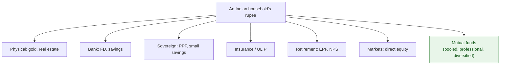
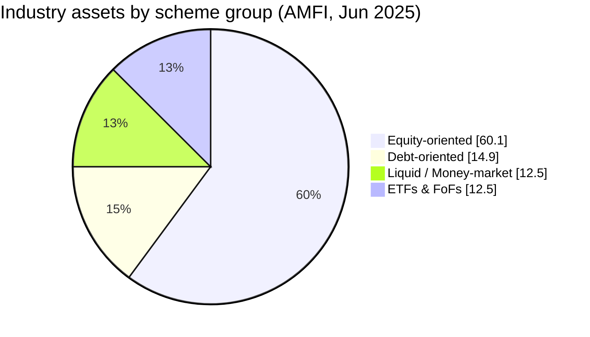
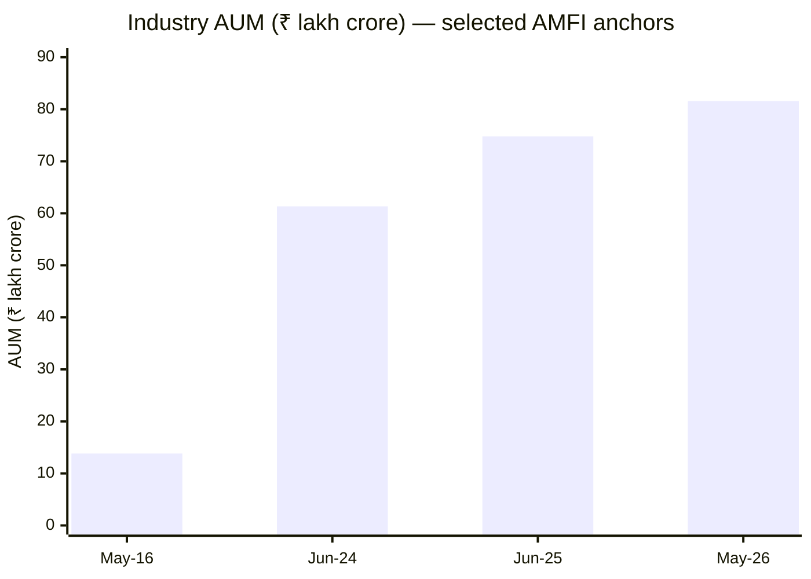
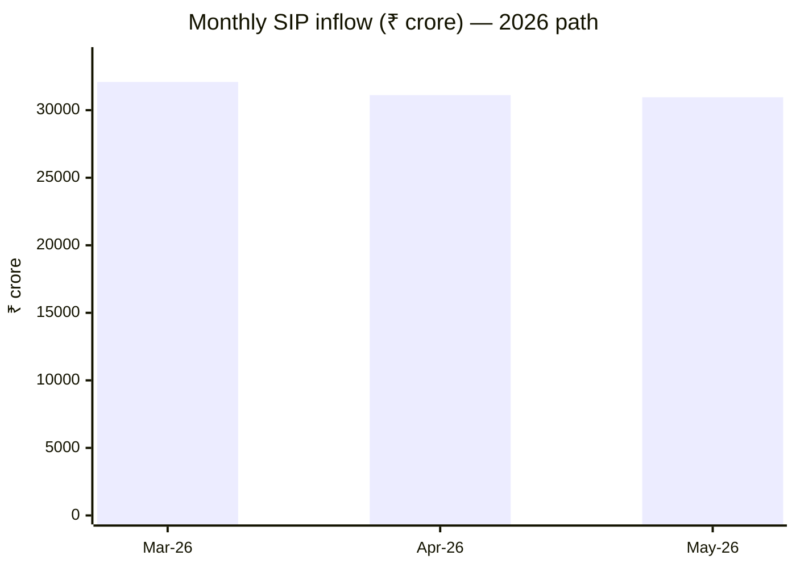
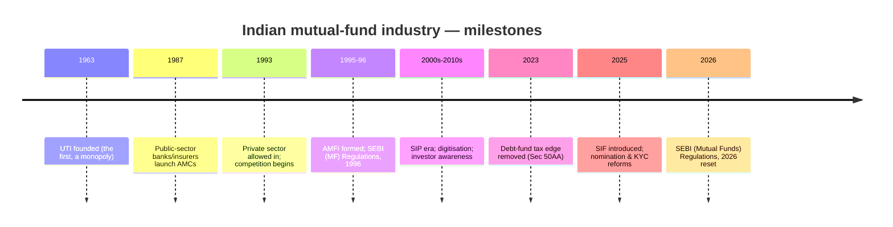

# M0 · Introduction to the Indian Mutual Fund Market

!!! abstract "Learning objectives"
    By the end of this module you will be able to:

    - Place mutual funds within India's **savings landscape** and explain the **financialisation** of household savings.
    - State **how big** the industry is — AUM, AAUM, folios, AMCs, schemes — and how **under-penetrated** it remains (AUM-to-GDP).
    - Describe **who owns the assets** — individuals vs institutions, equity vs debt, T-30 vs B-30, direct vs regular.
    - Explain **how fast** it is growing — the decade-long ~6× rise and the **SIP engine** behind it.

This is your **first orientation** — the *map before the journey*. It covers **size, ownership, growth and context** only. **Mechanics** (NAV, units, costs) start at [**M1**](m01-what-is-a-fund.md); the **analyst-level economics** (flows, margins, unit economics) live in [**M17**](m17-industry-economics.md). No formulas here except one simple ratio (AUM-to-GDP).

!!! info "Single source of truth + recency caveat"
    The headline figures below are this program's **canonical numbers** — later modules quote *these*, not their own. **Monthly** metrics are as of **May 2026** (latest AMFI release); **composition/ownership** cuts are from AMFI's **Industry Trends (June 2025)** and **Annual Report FY25**, the latest official structural breakdowns. **Every figure moves** — treat this as a *live baseline* and re-check against AMFI/SEBI. Figures sourced from the **seed document are not used**; all are AMFI/SEBI primary.

---

## 1. Intuition first — where mutual funds sit in India's savings

For generations, Indian households saved mostly in **physical assets** (gold, land) and **bank deposits**. Over the last decade money has steadily **financialised** — shifting toward financial assets, and within them toward **mutual funds**, as incomes rose, banks digitised, and awareness spread. This matters because financial savings are **more productive** (they fund companies and the economy), **more liquid and transparent**, and — through funds — give a small saver **professional management and diversification** they could never assemble alone. The mutual fund is the vehicle carrying this shift.

### Where a fund sits among the saver's options

**Table A — how mutual funds compare with other avenues** *(qualitative, beginner-level)*

| Avenue | Return potential | Liquidity | Risk | Taxation (broad) | Typical ticket |
|---|---|---|---|---|---|
| **Bank FD** | Low–moderate, *fixed* | High (premature penalty) | Very low | Interest at slab | ₹1,000s |
| **Gold** | Moderate, volatile | High (ETF/physical) | Moderate | Fund: 12.5% if >24m | Low |
| **Real estate** | Moderate, lumpy | Very low | Moderate–high | Complex; LTCG | Very high (₹ lakhs+) |
| **Direct equity** | High, volatile | High | High | Like equity funds | One share's price |
| **Mutual fund** | **Varies by type** | **High** (open-ended) | **Varies by type** | **By bucket (M8)** | **₹100–₹500** |
| **NPS (retirement)** | Market-linked | Very low (locked to ~60) | Low–moderate | Largely tax-favoured; annuity taxed | ₹500+ |
| **Insurance / ULIP** | Low–moderate | Low (5-yr lock) | Low–moderate | Conditional exemptions | ₹1,000s |
| **PPF / small savings** | Moderate, *fixed*, sovereign | Very low (long lock) | Negligible | Tax-free (EEE) | ₹500+ |

The mutual fund's distinctive combination: **low entry, high liquidity, professional diversification, and a risk level you choose by category** — which is why it has become the default wealth-building vehicle for the financialising household.

---

## 2. Size of the market

### Table B — Industry at a glance

| Metric | Value | As of | Source |
|---|---|---|---|
| **Total AUM** | **₹81.58 lakh crore** (₹81.6 trillion) | 31 May 2026 | AMFI |
| **Average AUM (AAUM)** | **₹83.47 lakh crore** | May 2026 | AMFI |
| **Investor folios** | **27.66 crore** (≈21.1 cr in equity/hybrid/solution) | 31 May 2026 | AMFI |
| **AMCs** | **~44–47** SEBI-registered (top 10 hold **>80%** of AUM) | 2026 | AMFI/SEBI *[verify exact count]* |
| **Schemes** | **~1,500** distinct schemes *(thousands more counting plan/option variants)* | 2026 | AMFI *[verify exact count]* |
| **Categories** | **5 families · ~36 sub-categories** (+ 2026 additions, M3) | 2026 | SEBI |

### Penetration & runway — the "why now"

!!! note "The one ratio in this module — AUM-to-GDP"
    **AUM-to-GDP (penetration)** measures industry assets against the size of the economy. India's mutual-fund AUM-to-GDP sits in roughly the **high-teens-to-low-20s %** range, versus **~80%+ in the United States** and a **world average near ~75%**; India's *equity* MF-to-GDP is only **~8%** (vs ~98% US). *[verify exact current ratio — estimates vary by AUM measure and GDP base]*

This gap **is** the opportunity: even after a decade of ~6× growth, India remains **heavily under-penetrated**, implying a long runway as penetration converges toward global norms. That is the "why now" of the Indian mutual-fund story.

### Table C — Asset-class composition of industry assets *(AMFI Industry Trends, June 2025)*

| Scheme group | Share of assets | Note |
|---|---|---|
| **Equity-oriented** (incl. balanced/hybrid) | **60.1%** | Retail-driven growth engine |
| **Debt-oriented** | **14.9%** | Institution-heavy |
| **Liquid / Money-market** | **~12.5%** | Treasury/corporate parking |
| **ETFs & FoFs (passive)** | **12.5%** | Fast-growing passive share |

*(AMFI groups balanced/hybrid within "equity-oriented"; solution-oriented is small and folded in. Shares move monthly.)*

---

## 3. Distribution between investors

### Table D — Industry assets by investor type *(AMFI Industry Trends, June 2025)*

| Investor type | Share of AUM | Value | Note |
|---|---|---|---|
| **Individuals** (retail + HNI + NRI) | **60.7%** | **₹45.38 lakh crore** | HNI = ticket ≥ ₹2 lakh |
| **Institutions** (corporates, banks, FIs) | **39.3%** | **₹29.41 lakh crore** | Of which **corporates ≈ 94%** |
| **Total** | 100% | **₹74.79 lakh crore** (Jun 2025) | grows monthly |

### The asymmetry that recurs through the program

This is one of the most important structural facts in Indian mutual funds, and it returns in **M16/M17**:

!!! note "Individuals own equity; institutions own debt"
    - **Equity-oriented schemes derive ~88% of their assets from individual investors.**
    - **Institutions dominate** liquid/money-market (**~89%**), debt-oriented (**~66%**) and ETFs/FoFs (**~87%**).
    - **87% of individual investors' assets** are in equity-oriented schemes; **~53% of institutional assets** sit in liquid + debt.

    *(AMFI Industry Trends, June 2025.)* So **retail behaviour drives equity flows** — the swing factor in market stability — while institutions anchor the debt and cash side. The seed document's rounded "~90% / ~80%" is in the right direction; the **verified AMFI figures are 88% (equity, individuals) and 66%/89% (debt/liquid, institutions)**.

### Two further cuts

- **Geography — T-30 vs B-30.** About **84%** of assets come from the **Top-30 cities (T-30)** and **~16% from Beyond-30 (B-30)** locations; notably, a **higher share of B-30 money is in equity** (~62%). *(AMFI FY25; [verify latest])* B-30 growth is a financial-**inclusion** indicator.
- **Direct vs Regular.** Institutional money is **largely Direct**; individual money skews **Regular** (distributor-sold). The overall **Direct** share of industry AUM is **substantial and rising**, pushed by fintech platforms. *[verify exact current split]*

!!! warning "Folios ≠ investors, and folios ≠ AUM"
    There are **27.66 crore folios** but **far fewer unique investors** — one person commonly holds **many** folios across AMCs (M5). And the **count** of folios is **retail-heavy**, while the **value** of AUM is far more concentrated in **HNIs and institutions**. Never read folio counts as a head-count of people or as a proxy for assets.

---

## 4. Market movement & MF growth

### Table E — Industry AUM growth *(selected AMFI anchors)*

| Date | Industry AUM | Source |
|---|---|---|
| May 2016 | **₹13.82 lakh crore** | AMFI |
| Jun 2024 | ₹61.33 lakh crore (AAUM) | AMFI |
| Jun 2025 | ₹74.79 lakh crore (AAUM) | AMFI |
| **May 2026** | **₹81.58 lakh crore** | AMFI |

Over the decade the industry grew **~6×** — roughly a **19–20% CAGR**. *(Full annual series available from AMFI; [verify intermediate years].)*

!!! tip "How much 'growth' is real new money?"
    AUM rises from **two** sources: **net inflows** (fresh money) and **market mark-to-market** (existing assets appreciating). In a rising market a large slice of AUM "growth" is **mark-up, not new money** — which reverses when markets fall. Analysts always separate the two (the method is in [**M17**](m17-industry-economics.md)). Don't read AUM growth as a pure inclusion or skill signal.

### The SIP engine — the structural story

| SIP metric | Value | As of | Source |
|---|---|---|---|
| **Monthly SIP inflow** | **₹30,954 crore** (record ₹32,087 cr, Mar 2026) | May 2026 | AMFI |
| **Contributing SIP accounts** | **9.64 crore** | May 2026 | AMFI |
| **SIP AUM** | **₹17.12 lakh crore** (**~21% of industry AUM**) | May 2026 | AMFI |

The **SIP** — a fixed monthly auto-investment — is the defining feature of the modern industry: a **~₹30,000-crore monthly flow that arrives regardless of market mood**, financing redemptions and stabilising markets. It is why domestic retail now anchors Indian equities.

### Growth drivers and headwinds

!!! note "Why it grows — and what could slow it"
    **Drivers:** rising incomes and a young **demographic dividend**; **digital/fintech** distribution widening the funnel; spreading **awareness** (AMFI's "Mutual Funds Sahi Hai"); **financialisation** away from gold/property; the **SIP** habit; **B-30** penetration.

    **Headwinds:** market drawdowns denting sentiment and flows; **mis-selling** and trust gaps; the post-2023 **debt-tax** change cooling debt flows (M8); global shocks; and the **fee/margin pressure** reshaping the supply side (M17/M20).

---

## 5. Definitions box

!!! note "Orientation terms (one line each)"
    - **AUM (Assets Under Management)** — the total market value of all money a fund/industry manages, at a point in time.
    - **AAUM (Average AUM)** — the *average* of daily AUM over a month (used for fees and official comparisons).
    - **AUM-to-GDP (penetration)** — industry AUM ÷ the economy's GDP; how deeply mutual funds reach the economy.
    - **Folio** — an investor's account number with a fund house (one person may hold many).
    - **SIP (Systematic Investment Plan)** — a fixed amount invested automatically every month.
    - **T-30 / B-30** — the **Top-30** cities vs **Beyond-30** (smaller towns), an inclusion/geography cut.

    *(No NAV, returns or cost math here — those begin in M1.)*

---

## 6. A short history of the industry

*Orientation only — the law itself is [**M18**](m18-sebi-regulations-2026.md); the economics are [**M17**](m17-industry-economics.md).*

---

## 7. Common mistakes & Do's and Don'ts

!!! danger "Beginner confusions about 'the market'"
    1. **Folios = investors.** No — one person holds **many** folios; 27.66 cr folios ≠ 27.66 cr people.
    2. **AUM growth = net inflows.** No — much is **market mark-to-market**, which reverses in a fall.
    3. **A month-end snapshot is 'the' size.** Figures are **month-end and seasonal**; they move every month.
    4. **"Under-penetrated" = guaranteed growth.** It's a *runway*, not a promise — sentiment and shocks matter.

!!! success "Do"
    - **Do** quote figures **with their date and source**, and treat them as a live baseline.
    - **Do** separate **flows from market moves** when reading AUM growth.
    - **Do** read **folio counts (head-count-ish) and AUM value (money) as different things**.

!!! failure "Don't"
    - **Don't** treat the seed document's numbers as truth — use these AMFI/SEBI figures.
    - **Don't** equate folio growth with new unique investors.

---

## 8. Applicable SEBI (Mutual Funds) Regulations, 2026 / AMFI role

- **Categorisation framework** — the **5 families / ~36 categories** (and 2026 updates, [**M3**](m03-taxonomy.md)) are *why* scheme counts and category labels look as they do; it standardises the shelf this module is counting. *[verify circular ref]*
- **AMFI's data-disclosure role** — AMFI is the industry body ([**M2**](m02-ecosystem.md)) that **compiles and publishes** the AUM/AAUM/folio/SIP/Industry-Trends data used throughout this module; SEBI mandates the underlying disclosures. *[verify]*
- The substantive law (cost, governance, true-to-label, timeline) is the dedicated subject of [**M18**](m18-sebi-regulations-2026.md).

---

## 9. Key takeaways

!!! quote "Key takeaways"
    - Mutual funds are the vehicle of India's **financialisation** of savings — low entry, high liquidity, professional diversification.
    - **Size (May 2026):** **₹81.58 lakh cr AUM**, **₹83.47 lakh cr AAUM**, **27.66 cr folios**, ~44–47 AMCs — yet **under-penetrated** (AUM-to-GDP ~high-teens-to-low-20s% vs ~80%+ US).
    - **Ownership:** individuals **60.7%** of AUM and **~88% of equity**; institutions **39.3%** and the bulk of **debt/liquid** — retail drives equity flows.
    - **Growth:** ~**6× in a decade (~19–20% CAGR)**, powered by the **SIP engine** (₹30,954 cr/month, 9.64 cr accounts, ~21% of AUM).
    - These are this program's **single-source-of-truth** figures — dated, AMFI/SEBI-sourced, and **moving**.

---

## 10. A word from the field

!!! quote "On the industry's mission"
    *"Mutual Funds Sahi Hai."*

    — **AMFI**'s national investor-awareness campaign (launched 2017). The slogan captures this module's "why now": as India's savings financialise and penetration is still a fraction of global norms, the campaign's wager is that bringing more households into **regulated, diversified, professionally-managed** funds is — done sensibly — a sound choice. The *how* to do it sensibly is the rest of this program.
