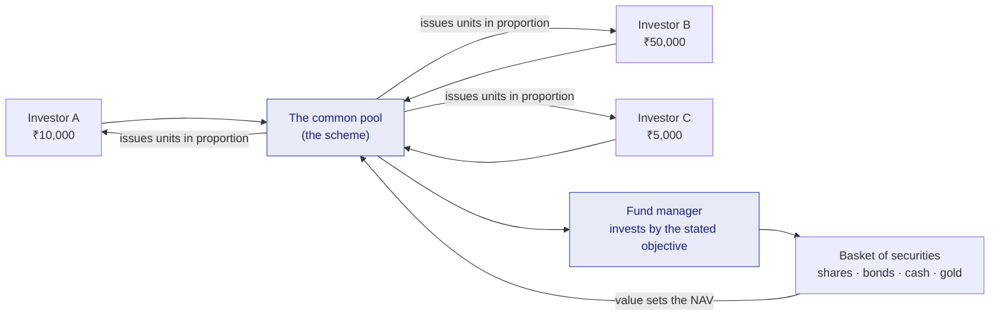

# M1 · What a Fund Is

!!! abstract "Learning objectives"
    By the end of this module you will be able to:

    - Explain, in plain language, what a mutual fund is and **why pooling money** solves problems a small investor cannot solve alone.
    - Define **NAV** (Net Asset Value) and **units**, and compute both from first principles.
    - Trace exactly **how you make or lose money** in a fund, and why that is different from a fixed deposit.
    - Avoid the four beginner traps — chasing a "low NAV", confusing units with shares, expecting a guaranteed return, and misreading IDCW ("dividend") payouts.

This module assumes **nothing**. Every term is defined the first time it appears.

---

## 1. Intuition first — why pool money at all?

Imagine you have ₹10,000 to invest and you believe Indian companies will grow over the next ten years. You *could* buy shares directly. But ₹10,000 buys you perhaps one share of a single expensive company, or a handful of shares of one or two cheaper ones. If that one company stumbles, your whole ₹10,000 suffers. You also have to decide *which* companies, *when* to buy and sell, and you have to do the paperwork, track the holdings, and find the time and knowledge to do it well.

Now imagine ten thousand people, each with ₹10,000, put their money into a **common pool** worth ₹10 crore. With ₹10 crore, a full-time professional can buy a *basket* of fifty or sixty companies across many industries. If one company stumbles, it is a small part of a large basket — the damage is diluted. The professional does the choosing, the buying and selling, and the record-keeping. Each of the ten thousand people owns a **proportional slice** of the whole basket.

That common pool, run by a professional manager according to a written objective, is a **mutual fund**. The word "mutual" is the key: the gains, the losses, the costs and the risks are *shared in proportion to how much each person put in*.

!!! note "Definition — Mutual fund"
    A **mutual fund** is a pooled investment vehicle. Many investors contribute money to a common pool; a professional **fund manager** invests that pool in a basket of securities — shares, bonds, money-market instruments, gold, or a mix — according to a **stated objective**. You do not own the underlying securities directly; you own **units** of the fund, and each unit is an equal, proportional slice of the whole pool.

The appeal, in one sentence: for a few hundred rupees you get instant **diversification** (spreading money across many securities so no single one can sink you), **professional management**, and **convenience** — things that would be expensive and time-consuming to assemble yourself.

### The five things pooling buys you

1. **Diversification** — many securities instead of one or two, so risk is spread.
2. **Professional management** — a full-time manager and research team decide what to buy and sell.
3. **Scale and access** — ₹10 crore can buy instruments (large bond lots, certain institutional securities) a ₹10,000 investor cannot.
4. **Convenience** — one instrument to buy, hold and track instead of fifty.
5. **Low minimums** — you can start a fund with as little as ₹100–₹500, an amount that buys almost nothing directly.

---

## 2. Units and NAV — the heart of the mechanism

When you put money into the pool, you are not handed shares of Infosys or a government bond. You are issued **units** of the fund. A unit is simply a token of ownership: if the fund's total pool is worth ₹100 crore and there are 10 crore units in existence, each unit represents ₹10 of the pool.

That per-unit value has a name: the **Net Asset Value**, or **NAV**.

!!! note "Definition — NAV (Net Asset Value)"
    **NAV** is the value of one unit of the fund. It is the total value of everything the fund owns, *minus* what it owes, divided by the number of units outstanding:

    $$\text{NAV} = \dfrac{\text{Total assets} - \text{Liabilities}}{\text{Units outstanding}}$$

    **Assets** = the market value of all securities held + cash + receivables (e.g. dividends due to the fund). **Liabilities** = amounts the fund owes, including accrued expenses (the management fee and other costs build up daily). **Units outstanding** = the total number of units held by all investors.

### Worked example 1 — computing NAV from scratch

An equity scheme's books at the close of one business day:

| Item | Amount |
|---|---|
| Market value of shares held | ₹500.0 crore |
| Cash and bank balance | ₹12.0 crore |
| Dividends receivable | ₹3.0 crore |
| **Total assets** | **₹515.0 crore** |
| Less: payables (trades to settle) | ₹1.4 crore |
| Less: accrued expenses (fees, charges) | ₹0.6 crore |
| **Total liabilities** | **₹2.0 crore** |
| Net assets (515.0 − 2.0) | ₹513.0 crore |
| Units outstanding | 51.3 crore units |

$$\text{NAV} = \frac{513.0\ \text{crore}}{51.3\ \text{crore units}} = ₹10.00\ \text{per unit}$$

Notice three things. First, NAV is **derived**, not set by anyone — it falls out of the value of the holdings. Second, it is struck **once per business day**, after markets close and all holdings are valued ("marked to market"); you do **not** get a live, second-by-second price like a stock. Third, expenses are subtracted *before* NAV is computed, so the fee you pay is already inside the NAV — you never see a separate bill (cost mechanics come in [**M4**](m04-cost-and-plans.md)).

### Worked example 2 — how many units your money buys

You invest a lump sum of **₹25,000** in a scheme whose NAV today is **₹248.50**. Since entry load is banned in India, the whole amount buys units:

$$\text{Units} = \frac{₹25{,}000}{₹248.50} = 100.604\ \text{units}$$

Funds allow **fractional units** (up to three or four decimals), so no rupee is left idle. You now own 100.604 units of the scheme.

!!! tip "A high NAV is not 'expensive' and a low NAV is not 'cheap'"
    A ₹10 NAV is not a bargain and a ₹250 NAV is not dear. NAV is just the pool divided by the number of units — it says nothing about future returns. ₹25,000 buys you ₹25,000 of the same portfolio whether the NAV is ₹10 or ₹250; you simply get more units at the lower NAV and fewer at the higher one. What grows your money is the **percentage** by which the portfolio rises, not the starting NAV. This is the single most common beginner mistake, and New Fund Offers (NFOs) priced at ₹10 exploit it.

---

## 3. How you actually make — or lose — money

Your wealth in a fund is simply **units × NAV**. There are two ways that number changes.

**(a) NAV appreciation (the main engine).** When the securities in the pool rise in value, the NAV rises, and your units are worth more. This is unrealised gain until you sell ("redeem") your units.

**(b) IDCW payouts (optional, and widely misunderstood).** Every scheme offers two **options**: a **Growth** option, where all gains stay inside the fund and compound, and an **IDCW** option — *Income Distribution cum Capital Withdrawal*, the term SEBI now mandates instead of the old, misleading word "dividend". Under IDCW, the fund periodically pays out some money to you, **and the NAV falls by exactly that amount on the same day**. It is not extra income falling from the sky — it is your own capital handed back to you, and it may even be taxable. For wealth creation, the **Growth** option is almost always the right default; IDCW exists mainly for investors who want a periodic cash flow.

!!! note "Definition — IDCW (Income Distribution cum Capital Withdrawal)"
    A scheme **option** that periodically pays cash to unit-holders. The payout is funded *from the fund's own NAV*, which drops by the per-unit payout amount on the record date. IDCW is **not** a bonus return; it is a partial return of your own money. The alternative is the **Growth** option, where nothing is paid out and gains compound inside the unit's NAV.

### Worked example 3 — a year of gains

Recall you hold **100.604 units** bought at NAV ₹248.50 (₹25,000 invested). A year later the portfolio has risen and the NAV is **₹275.20**.

$$\text{Value} = 100.604 \times ₹275.20 = ₹27{,}686$$

$$\text{Absolute return} = \frac{27{,}686 - 25{,}000}{25{,}000} = 10.74\%$$

You made ₹2,686, a 10.74% gain over the year — purely from NAV appreciation, with no payout. (Comparing returns *properly* across different time periods needs CAGR and risk adjustment, which we build in [**M9**](m09-risk-adjusted-performance.md); here the point is just the mechanism.)

But the NAV can equally fall. If markets had dropped and the NAV ended the year at **₹224.00**, your value would be 100.604 × 224.00 = **₹22,535**, a loss of ₹2,465 (−9.86%). This is the defining difference from a fixed deposit: a mutual fund's return is **not fixed or guaranteed**. You are a part-owner of real assets whose prices move every day.

### Worked example 4 — the SIP, in miniature

Most Indians invest not as a lump sum but through a **Systematic Investment Plan (SIP)** — a fixed amount invested automatically every month. Suppose you invest **₹5,000** on the same date each month into the scheme above:

| Month | Amount | NAV that day | Units bought (Amount ÷ NAV) |
|---|---|---|---|
| 1 | ₹5,000 | ₹248.50 | 20.121 |
| 2 | ₹5,000 | ₹240.10 | 20.825 |
| 3 | ₹5,000 | ₹255.30 | 19.585 |
| **Total** | **₹15,000** | — | **60.531 units** |

Your average cost per unit = ₹15,000 ÷ 60.531 = **₹247.81**, which is *lower* than the simple average of the three NAVs (₹247.97). The reason: a fixed rupee amount automatically buys **more units when the NAV is low** and fewer when it is high. This is **rupee-cost averaging**, and it is the quiet engine behind India's SIP culture. (SIP strategy and its limits get full treatment in [**M5**](m05-investor-journey.md) and [**M6**](m06-lifecycle-decisions.md).)

---

## 4. A mutual fund versus the alternatives

To place the fund correctly in a beginner's mind, contrast it with the two instruments most Indians already know.

| | Fixed Deposit (FD) | Direct shares | **Mutual fund** |
|---|---|---|---|
| Return | Fixed, known in advance | Variable, you choose stocks | Variable, manager chooses a basket |
| Risk | Very low (bank guarantee up to limits) | High, concentrated | Spread across many securities |
| Who decides | The bank | You | A professional manager |
| Diversification | None needed | Only if you build it yourself | Built in |
| Minimum to start | ₹1,000s | One share's price | ₹100–₹500 |
| Effort | None | High | Low |

A fund sits between the safety-and-certainty of an FD and the do-it-yourself control of direct shares: you accept market risk in exchange for the chance of higher long-run returns, while outsourcing the work and getting diversification for free.

---

## 5. A picture of the whole idea

The diagram captures the entire module: money flows in, becomes a pool, the manager turns the pool into a basket of securities, the basket's value sets the NAV, and units flow back to each investor in proportion to what they put in. *Who* runs and polices this machinery — the AMC, trustees, custodian, RTA and regulator — is the subject of [**M2**](m02-ecosystem.md).

---

## 6. Common mistakes & Do's and Don'ts

!!! danger "Four traps that catch beginners"
    1. **"The ₹10 NAV fund is cheaper."** No. NAV level is irrelevant to future return; only the percentage move matters. An NFO at ₹10 is not a discount.
    2. **"I own shares of the companies."** You own **units of the fund**, not the underlying shares. You cannot vote in those companies or hold the shares directly.
    3. **"It's like an FD, so my money is safe and the return is fixed."** A fund's value moves with markets every day. There is no guaranteed return and the NAV can fall.
    4. **"The IDCW 'dividend' is bonus income."** It is your own capital paid back; the NAV drops by the same amount. For growth, choose the **Growth** option.

!!! success "Do"
    - **Do** think in *percentages and total value (units × NAV)*, never in NAV level.
    - **Do** match the fund's stated objective to your own goal and time horizon.
    - **Do** default to the **Growth** option unless you specifically need periodic cash.

!!! failure "Don't"
    - **Don't** judge a fund by its NAV being "low" or "high".
    - **Don't** watch the daily NAV like a stock ticker; funds are priced once a day for a reason.
    - **Don't** expect FD-style certainty from a market-linked product.

---

## 7. Applicable SEBI (Mutual Funds) Regulations, 2026

The very existence and mechanics described above are creatures of regulation. The following provisions of the **SEBI (Mutual Funds) Regulations, 2026** (approved 17 Dec 2025, effective 1 Apr 2026) govern this module. Section numbers are given only where verified against the primary text; otherwise the provision is described in words and tagged for verification.

- **A mutual fund must be constituted as a trust.** Your money is legally held *in trust* for unit-holders, separate from the sponsor and the AMC — which is *why* a fund "cannot simply vanish" even if the AMC fails. *[verify section no. — definitions/constitution chapter, 2026 Regulations]*
- **A unit represents the beneficial interest** of an investor in the scheme's assets — the legal basis for "you own units, not the underlying securities". *[verify section no.]*
- **Valuation and daily NAV.** Schemes must value their assets fairly (mark-to-market on the principle of fair valuation) and compute and **publish NAV every business day**, which is why NAV is a once-a-day figure. *[verify section no. — valuation norms / Eighth Schedule equivalent in 2026 Regulations]*
- **Scheme objective and "true to label".** Every scheme must invest in line with its **stated objective and category**, so the "stated objective" you rely on is legally binding on the manager. (Categorisation and true-to-label rules are detailed in [**M3**](m03-taxonomy.md) and [**M18**](m18-sebi-regulations-2026.md).) *[verify section no.]*
- **Entry load is prohibited**, which is why your full ₹25,000 was invested in Worked Example 2. *[verify — continued from the 2009 entry-load ban, retained in 2026 Regulations]*

!!! info "How we cite the law in this program"
    Where a clause number is shown without a `[verify]` tag, it has been checked against the primary text on sebi.gov.in. Where you see `[verify section no.]`, the *provision is real and in force* but we have not yet pinned the exact clause number in the renumbered 2026 text — we never invent a citation. [**M18**](m18-sebi-regulations-2026.md) resolves these to exact references.

---

## 8. Key takeaways

!!! quote "Key takeaways"
    - A **mutual fund** is a pooled vehicle: you own **units** of a professionally managed basket, not the underlying securities.
    - Pooling buys five things a small investor can't easily get alone: **diversification, professional management, scale, convenience, and low minimums**.
    - **NAV = (assets − liabilities) ÷ units**, struck **once per business day**; your wealth is simply **units × NAV**.
    - You make money mainly through **NAV appreciation**; **IDCW** payouts are a return of your own capital, not bonus income — default to **Growth**.
    - A fund is **not** an FD: returns are market-linked, variable, and not guaranteed. Judge funds by **percentage returns and total value**, never by NAV level.

---

## 9. A word from the field

!!! quote "On why a basket beats a single bet"
    *"Don't look for the needle in the haystack. Just buy the haystack."*

    — **John C. Bogle**, founder of Vanguard and creator of the first index mutual fund, in *The Little Book of Common Sense Investing*. His point: rather than gambling on finding the one winning stock, own a diversified basket and let the whole market's growth work for you — the founding intuition behind every mutual fund.
