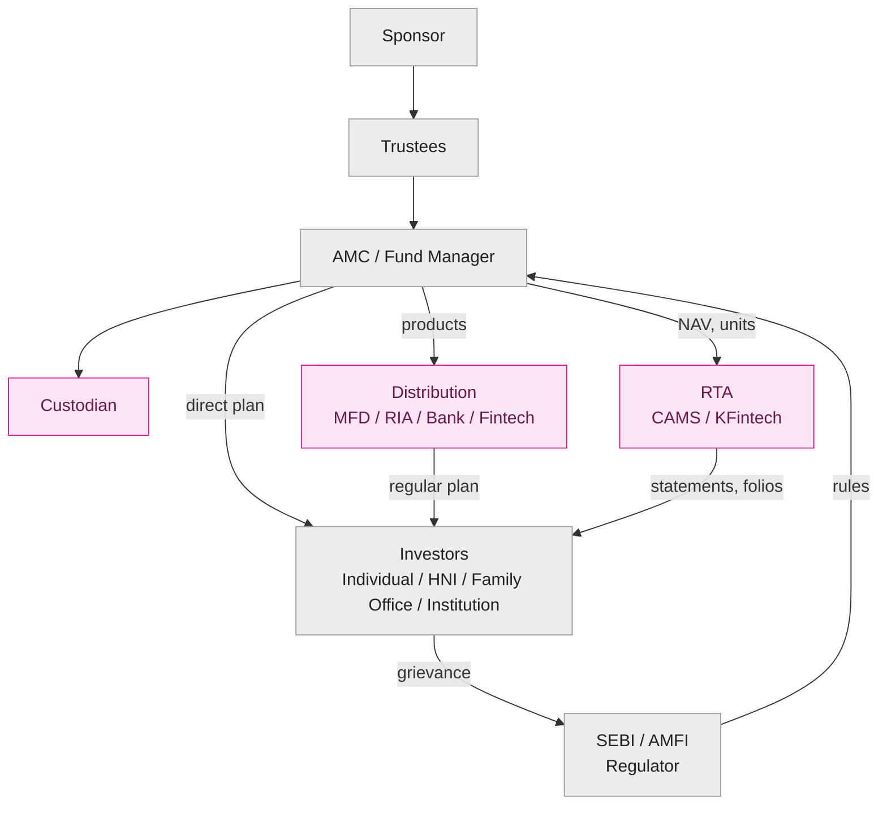

# M2 · The Mutual-Fund Ecosystem & Its Flows

!!! abstract "Learning objectives"
    By the end of this module you will be able to:

    - Name **every party** that touches your money in an Indian mutual fund and say **what each one does and why it exists**.
    - Explain the **separation-of-powers** design — why no single party can run off with the pool — and trace it to the legal **trust** structure.
    - Follow the **money and units** end-to-end when you buy and when you redeem, including who holds the assets and who keeps the records.
    - Distinguish **regular vs direct** plans, **SEBI vs AMFI**, and **MFD vs RIA**, and know where to take a **grievance**.

This module builds directly on [**M1**](m01-what-is-a-fund.md). There you learned *what* a fund is (a pooled vehicle priced by NAV); here you learn *who runs it* and *how value flows*.

---

## 1. Intuition first — why so many middlemen?

A natural beginner reaction to the diagram below is: *why does my ₹10,000 need a sponsor, trustees, an AMC, a custodian, a registrar, a regulator and an industry body? Isn't that a lot of mouths to feed?*

The answer is a single design principle: **the people who decide what to buy must never be the same people who hold the cash and securities, and both must be watched by someone whose only job is to protect you.** This is deliberate separation of powers. The fund manager *decides*; the custodian *holds*; the registrar *records*; the trustees *police*; the regulator *writes and enforces the rules*. Because these roles sit in different, independent hands, a rogue manager cannot quietly drain the pool — the assets are not in the manager's possession to drain.

This is the structural reason Indian mutual funds have a strong safety record. **Funds can lose value if markets fall — that risk is real and yours — but the architecture is built so your money cannot simply *vanish* through fraud or an AMC's bankruptcy.** Your money is held *in trust*, legally ring-fenced from the firms that run it.

---

## 2. The ecosystem at a glance

The diagram below is a **faithful reproduction of the project wireframe** — every box and every labelled arrow preserved, redrawn in Mermaid so it renders natively on GitHub Pages.



!!! abstract "Wireframe completeness check"
    **Every entity in the wireframe is drawn:** Sponsor · Trustees · SEBI/AMFI (Regulator) · AMC/Fund Manager · Custodian · RTA (CAMS/KFintech) · Distribution (MFD, RIA, Bank, Fintech) · Investors (Individual, HNI, Family Office, Institution).

    **Every flow in the wireframe is drawn:** Sponsor→Trustees · Trustees→AMC · Regulator→AMC (**rules**) · AMC→Distribution (**products**) · AMC→Custodian · AMC→RTA (**NAV, units**) · AMC→Investors (**direct plan**) · Distribution→Investors (**regular plan**) · RTA→Investors (**statements, folios**) · Investors→Regulator (**grievance**). Nothing in the wireframe is left uncovered.

---

## 3. The cast of characters — who each party is and why it exists

### 3.1 Sponsor — the promoter who starts the fund

The **sponsor** is the parent that establishes the mutual fund, much as a promoter founds a company. Think of HDFC, ICICI, SBI or Nippon Life behind their AMCs. To qualify, a sponsor must have a **sound financial track record** (historically five years of profitability and good standing) and must **put real capital at stake** by contributing to the AMC's net worth — long-standing rule: **at least 40% of the AMC's net worth** *[verify section no., 2026 Regulations]*. This capital-at-stake requirement aligns the sponsor's incentives with investors: it has skin in the game.

!!! note "Nuance — the 'self-sponsored' AMC route"
    Since 2023 SEBI has allowed an established AMC with a strong track record to continue **without an eligible sponsor** (a "self-sponsored" AMC), and the 2026 framework retains a modernised sponsor-eligibility regime, including a private-equity sponsor route. The principle is unchanged: whoever sponsors must be financially sound and accountable. *[verify section no.]*

### 3.2 Trustees — the watchdog that holds the fund in trust

The **trustees** (organised as a Trustee Company or a Board of Trustees) are the legal **owners-in-trust** of the scheme's assets, holding them *for the benefit of unit-holders*. They are a **separate body from the AMC**, and their job is to **police the AMC on your behalf** — to ensure it invests within mandate, complies with regulation, and puts unit-holders first. To keep them genuinely independent, **at least two-thirds of trustees must be independent** of the sponsor *[verify section no.]*. The 2026 Regulations notably **tighten trustee oversight** and conflict-of-interest controls.

This is the heart of the safety design: the trustees answer to you, not to the AMC's shareholders.

### 3.3 AMC / Fund Manager — the business that runs the schemes

The **Asset Management Company (AMC)** is the operating business that **designs and manages the schemes** for a fee — HDFC AMC, ICICI Prudential AMC, SBI Funds, Nippon India, and so on. Inside the AMC sits the **fund manager** (and a team of analysts), the professional who makes the actual buy/sell decisions within each scheme's mandate. The diagram's single box "AMC / Fund Manager" bundles the firm and the decision-maker; in practice the AMC is the licensed entity and the fund manager is its key employee.

The AMC carries capital and governance obligations: a **minimum net worth** (the 2026 framework requires roughly **₹75 crore at registration, maintained at ₹50 crore, reducing to ₹25 crore after five years** *[verify exact figures & section no.]*), an AMC board with a strong **independent-director** component, and — new and important in 2026 — **heightened personal accountability of Key Management Personnel (KMP)**: named CEOs, CIOs, and heads of compliance and risk can be held individually answerable for mispricing, mis-disclosure or abusive practices.

!!! note "What the AMC earns — and the 2026 change"
    The AMC earns a management fee embedded in the scheme's expense ratio. The 2026 Regulations replace the old all-in **TER** with a **Base Expense Ratio (BER)**-centric model and permit **optional performance-linked fees**. The economics of this are the subject of [**M4**](m04-cost-and-plans.md) (cost) and [**M17**](m17-industry-economics.md) (industry economics); here, simply note the AMC is paid *out of the fund*, never billed to you separately.

### 3.4 Custodian — the independent vault

The **custodian** is an independent, SEBI-registered institution that **physically holds the scheme's securities and settles its trades**, so the AMC never directly touches the assets. This is the practical enforcement of separation of powers: when the fund manager decides to buy ₹5 crore of a stock, the custodian is the party that receives the shares and pays for them on settlement. The custodian must be **independent of the sponsor** (subject to association limits) precisely so it acts as a genuine check. *[verify section no.]*

### 3.5 RTA — CAMS & KFintech, the record-keepers

The **Registrar & Transfer Agent (RTA)** keeps the master record of **who owns which units** and processes every transaction — purchases, redemptions, switches, SIP instalments — and issues your **account statements and folios**. India's RTA layer is effectively a **duopoly**: **CAMS** and **KFintech** service almost the entire industry between them. When you see "folio number" or get a Consolidated Account Statement (CAS), that is the RTA at work. In the wireframe, the AMC feeds the RTA **NAV and units**, and the RTA sends you **statements and folios**.

!!! note "Definition — Folio"
    A **folio** is your account number with a particular fund house — the unique identifier under which all your units, transactions and contact details are recorded by the RTA. One investor can hold multiple folios across (and even within) AMCs.

### 3.6 Distribution — how the product reaches you (MFD · RIA · Bank · Fintech)

The **distribution** layer connects schemes to investors. It comes in four flavours, and the difference between the first two is one of the most important — and most misunderstood — facts in Indian investing:

- **MFD (Mutual Fund Distributor).** Holds an **ARN** (AMFI Registration Number), sells **regular plans**, and is paid an ongoing **commission (trail)** embedded in the scheme's expense ratio. An MFD can *recommend and transact* but is a seller, not a fee-only adviser.
- **RIA (Registered Investment Adviser).** **SEBI-registered**, gives **fee-only advice** (you pay the RIA directly), and is required to act in your interest. RIAs typically steer you to **direct plans** (no commission), charging a transparent advice fee instead.
- **Bank channel.** Banks act as MFDs, distributing funds to their account-holders — convenient, but commission-driven and prone to in-house product bias.
- **Fintech / platform.** App-based platforms (execution-only platforms and RIA-led apps) that let you transact, often in **direct plans**, at low or zero platform cost.

!!! warning "MFD ≠ RIA — the conflict you must understand"
    An **MFD is paid by the fund house** (commission), so its incentive is to keep you invested in *regular* plans. An **RIA is paid by you** (fee), so its incentive aligns with your outcome. Neither is 'bad', but you should always know **who pays your adviser**. The regular-vs-direct cost gap this creates is quantified in [**M4**](m04-cost-and-plans.md).

### 3.7 SEBI vs AMFI — regulator vs industry body

The wireframe groups them in one box ("SEBI / AMFI Regulator"), but they are **not the same thing**:

- **SEBI (Securities and Exchange Board of India)** is the **statutory regulator** — it *writes the rulebook* (the SEBI (Mutual Funds) Regulations, 2026), registers and inspects every party above, and enforces the law. The "**rules**" arrow in the diagram originates here.
- **AMFI (Association of Mutual Funds in India)** is the **industry body / self-regulatory-style organisation** — a body *of* the AMCs. It sets codes of conduct, registers distributors (issues ARNs), publishes industry data, and runs the **"Mutual Funds Sahi Hai"** investor-awareness campaign. AMFI has standards-and-discipline power over distributors but is **not** the statutory regulator.

!!! note "One-line test"
    If a *rule* has the force of law, it comes from **SEBI**. If it is an *industry standard, an ARN, or investor education*, it comes from **AMFI**.

### 3.8 Investors — the four archetypes

The same product shelf is used very differently by four investor types, shown in the wireframe's Investors box:

- **Individual / Retail** — typical ticket ₹500–₹50,000; SIPs and small lump sums; mostly equity and hybrid.
- **HNI (High-Net-Worth Individual)** — ₹25 lakh to several crore; MFs *plus* PMS and AIFs; tax structuring and diversification.
- **Family Office** — pooled wealth of a wealthy family; long horizons; often advised by an in-house team or RIA.
- **Institution** — corporates, banks, insurers; ₹10s–₹1,000s of crore; debt-heavy, treasury and liquidity management.

The full behavioural and structural contrast between these archetypes (and the PMS/AIF adjacency) is [**M16**](m16-archetypes-pms-aif.md); here they complete the wireframe.

---

## 4. The flows — following money and units

The wireframe's arrows fall into four families. Understanding them *is* understanding the ecosystem.

| Flow (wireframe label) | From → To | What actually moves |
|---|---|---|
| **rules** | Regulator → AMC (and all parties) | Binding regulation, registration, inspection |
| **products** | AMC → Distribution | Scheme information, onboarding, commercial terms |
| **regular plan** | Distribution → Investor | A scheme bought *via* a distributor (commission embedded) |
| **direct plan** | AMC → Investor | The *same* scheme bought directly (no commission) |
| **NAV, units** | AMC → RTA | Daily NAV and unit-allotment data for record-keeping |
| **statements, folios** | RTA → Investor | Account statements, folio records, transaction confirmations |
| **grievance** | Investor → Regulator | Complaints and escalation (see §6) |

### Worked example — the journey of a ₹50,000 purchase

You invest **₹50,000** in the Direct–Growth plan of an equity scheme via a fintech app. Here is what really happens behind the single tap:

```mermaid
sequenceDiagram
    participant You as Investor
    participant App as Fintech / RTA front-end
    participant AMC as AMC (scheme account)
    participant Cust as Custodian
    participant RTA as RTA (CAMS/KFintech)
    You->>App: Place ₹50,000 purchase (Direct plan)
    App->>AMC: Money credited to the scheme's bank account
    Note over AMC: Applicable NAV = that business day's NAV<br/>(if money received before cut-off)
    AMC->>Cust: Manager deploys cash; Custodian settles & holds the securities
    AMC->>RTA: Sends allotment: units = ₹50,000 ÷ NAV
    RTA->>You: Folio updated; account statement issued
```

Suppose the applicable NAV that day is **₹312.40**. Units allotted = 50,000 ÷ 312.40 = **160.051 units**, recorded by the RTA under your folio. The cash sits in the *scheme's* bank account and the bought securities sit with the *custodian* — never in the AMC's own pocket. **Redemption runs the same chain in reverse**: you instruct, units are extinguished at the applicable NAV, the custodian releases securities for sale/settlement, and the proceeds are paid to your bank, typically within a few business days.

### Worked example — what the 'regular plan' arrow costs

Take the **same** scheme, **₹1,00,000** held for a year. In the **direct plan** there is no distributor commission. In the **regular plan**, a trail commission — say **0.60% a year** — is embedded in the expense ratio and paid by the AMC to your MFD out of the fund:

$$\text{Annual trail} = ₹1{,}00{,}000 \times 0.60\% = ₹600 \text{ per year}$$

You never see a ₹600 bill — it is silently deducted inside the NAV, so the regular plan's NAV grows slightly slower every year. Over long horizons this compounds into a meaningful gap (quantified fully in [**M4**](m04-cost-and-plans.md)). The "regular plan" and "direct plan" arrows in the wireframe are, in rupee terms, *this* difference.

---

## 5. Key definitions

!!! note "The ecosystem in one box"
    - **Sponsor** — promoter that establishes the fund and stakes capital in the AMC (≥40% of AMC net worth *[verify]*).
    - **Trustees** — independent body holding the fund in trust and policing the AMC for unit-holders (≥2/3 independent *[verify]*).
    - **AMC / Fund Manager** — licensed business that designs and manages schemes for a fee; the fund manager makes buy/sell calls.
    - **Custodian** — independent institution that holds the securities and settles trades.
    - **RTA (CAMS / KFintech)** — keeps the unit/folio records and issues statements.
    - **MFD** — commission-paid distributor (regular plans); **RIA** — fee-only SEBI-registered adviser (direct plans).
    - **SEBI** — statutory regulator (writes/enforces the law); **AMFI** — industry body (standards, ARNs, investor education).
    - **Folio** — your account number with a fund house.

---

## 6. Grievance — where to take a complaint

The wireframe's **grievance** arrow runs from investors to the regulator, but in practice there is an **escalation ladder**:

1. **The AMC first.** Every AMC has an investor-relations / grievance officer; raise it there to begin.
2. **SCORES.** If unresolved, escalate to **SEBI Complaints Redress System (SCORES)**, SEBI's online complaints portal, which routes and time-tracks your complaint against the AMC.
3. **Online Dispute Resolution (ODR / SMART-ODR).** For disputes not settled via SCORES, SEBI's **ODR platform** offers conciliation and online arbitration.

The 2026 Regulations explicitly **strengthen investor-grievance mechanisms**, reinforcing this ladder. *[verify section no.]*

---

## 7. Common mistakes & Do's and Don'ts

!!! danger "Misconceptions to unlearn"
    1. **"The AMC holds my money."** It does not. Cash sits in the scheme's bank account and securities sit with the **custodian**; the AMC only *decides*. This is why an AMC's failure does not vaporise your units.
    2. **"AMFI is the regulator."** No — **SEBI** is. AMFI is the industry body (ARNs, standards, awareness).
    3. **"My MFD and an RIA are the same."** An **MFD is paid by the fund house** (commission); an **RIA is paid by you** (fee). Know who pays your adviser.
    4. **"Direct plan means there's no AMC."** Direct just removes the *distributor*; the AMC still runs the scheme. You forgo advice, not management.

!!! success "Do"
    - **Do** know, for any rupee you invest, *who holds the asset* (custodian) and *who keeps the record* (RTA).
    - **Do** ask whether you are in a **regular or direct** plan, and who is paid for it.
    - **Do** use the **AMC → SCORES → ODR** ladder, in order, for grievances.

!!! failure "Don't"
    - **Don't** assume oversight equals zero risk — markets can still fall; the architecture protects against *fraud and loss-of-assets*, not against *market loss*.
    - **Don't** confuse SEBI (law) with AMFI (industry standards).

---

## 8. Applicable SEBI (Mutual Funds) Regulations, 2026

This entire structure is mandated by the Regulations. Key provisions touching this module *(section numbers pending verification against the renumbered 2026 text; the provisions are real and in force)*:

- **Three-tier structure (Sponsor – Trustees – AMC) and constitution as a trust.** The separation of decision, custody and oversight is a legal requirement, not a convention. *[verify section no.]*
- **Sponsor eligibility and capital contribution** — sound track record and minimum stake in AMC net worth; modernised sponsor routes (including self-sponsored and PE-sponsor). *[verify]*
- **Trustee independence and duties** — ≥2/3 independent; duty to oversee the AMC; **2026 tightening of trustee oversight and conflict-of-interest controls.** *[verify]*
- **AMC obligations** — minimum net worth, board independence, and **2026 heightened KMP (CEO/CIO/compliance/risk) accountability.** *[verify exact figures]*
- **Custodian independence** — assets held by a SEBI-registered custodian independent of the sponsor. *[verify]*
- **RTA / record-keeping and investor statements**, and **strengthened grievance redressal (SCORES / ODR)**. *[verify]*

(The full architecture, true-to-label rules, BER/TER unbundling, brokerage caps and the compliance timeline are the dedicated subject of [**M18**](m18-sebi-regulations-2026.md).)

---

## 9. Key takeaways

!!! quote "Key takeaways"
    - The ecosystem is built on **separation of powers**: the manager *decides*, the custodian *holds*, the RTA *records*, the trustees *police*, SEBI *rules*. No one party can drain the pool.
    - Your money is held **in trust** and ring-fenced — fraud and AMC-failure risk are designed out; **market risk remains yours**.
    - **SEBI** is the statutory regulator; **AMFI** is the industry body. **MFD** is commission-paid (regular plan); **RIA** is fee-paid (direct plan).
    - The **custodian holds the assets** and the **RTA keeps the folio**; the AMC touches neither cash nor securities directly.
    - Grievances escalate **AMC → SCORES → ODR**.

---

## 10. A word from the field

!!! quote "On why the structure matters"
    *"Mutual Funds Sahi Hai."* — **AMFI**'s national investor-awareness campaign (launched 2017).

    The slogan ("Mutual funds are a sound choice") rests on exactly the architecture in this module: an investor can trust the *product* because no single party controls the money, an independent trustee polices the manager, and a statutory regulator enforces the rules. The structure is what makes the confidence reasonable — not marketing.
