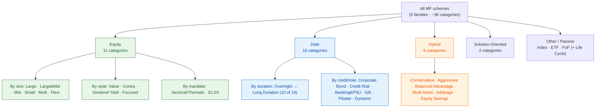

# M3 · Taxonomy of Schemes

!!! abstract "Learning objectives"
    By the end of this module you will be able to:

    - Place any Indian scheme into SEBI's **five families and ~36 standardised categories**, and say what each category must hold.
    - Apply the **market-cap definitions** (large / mid / small) and the **holding-percentage rules** that make a category mean the same thing across all AMCs.
    - Tell apart the look-alikes that confuse investors — **multi-cap vs flexi-cap**, **large-&-mid vs multi-cap**, **aggressive hybrid vs balanced advantage**, **arbitrage vs liquid**.
    - Read the **2026 categorisation upgrades** — **true-to-label** naming, the **50% scheme-overlap** cap, and the new **Life Cycle Funds**.

Builds on [**M1**](m01-what-is-a-fund.md) (what a fund is) and [**M2**](m02-ecosystem.md) (who runs it). Now: *what kinds* of fund exist, and why the menu is standardised.

---

## 1. Intuition first — why standardise categories at all?

Before 2018 every AMC named and built schemes as it liked. One firm's "Opportunities Fund" might be a large-cap; another's might be a small-cap. Investors could not compare like with like, and AMCs ran many near-identical "me-too" schemes to collect more money. SEBI's **Categorisation and Rationalisation** reform fixed this: it defined a **fixed menu** of categories, each with a **precise rulebook** (what it must hold and how much), and limited each AMC to **one scheme per category** (with a few exceptions). The 2026 framework keeps this spine and tightens it.

The payoff for you: a "**Large Cap Fund**" from HDFC and a "**Large Cap Fund**" from SBI now mean the *same thing* — both must keep at least 80% in India's hundred largest companies. Categories became a **common language**.

!!! note "The rule that makes categories trustworthy — 'true to label'"
    A scheme must do what its category name says, and its name may not over-promise. The 2026 rules require **uniform, category-aligned names** and **bar names that emphasise only return potential** (no "Super Wealth Multiplier Fund"). A category is now a *promise about holdings*, enforceable by the trustee and SEBI.

---

## 2. The whole taxonomy in one picture

---

## 3. Family 1 — Equity (the growth engine)

Equity schemes hold mostly **shares**: highest long-run return potential, highest short-term volatility, suited to goals **5+ years** away. The categories split three ways — **by company size, by style, and by mandate.**

### 3.1 The market-cap definitions (the foundation)

Every size-based category rests on one official list. **AMFI publishes, twice a year, a ranking of all listed companies by full market capitalisation:**

!!! note "Definition — Large / Mid / Small cap (SEBI/AMFI)"
    - **Large cap** = the **1st–100th** company by market capitalisation.
    - **Mid cap** = the **101st–250th** company.
    - **Small cap** = the **251st company onwards**.

    The list is fixed by **AMFI semi-annually**; funds must re-align to it. "Small cap" therefore means *rank*, not a small fund — a small-cap *scheme* can manage tens of thousands of crore.

### 3.2 The eleven equity categories and their holding rules

| Category | Core rule (minimum equity allocation) |
|---|---|
| **Large Cap** | ≥80% in large-cap (top-100) stocks |
| **Large & Mid Cap** | ≥35% large-cap **and** ≥35% mid-cap |
| **Mid Cap** | ≥65% in mid-cap stocks |
| **Small Cap** | ≥65% in small-cap stocks |
| **Multi Cap** | ≥25% **each** in large, mid and small cap (≥75% equity total) |
| **Flexi Cap** | ≥65% equity, **any** market-cap mix (manager's discretion) |
| **Value** | ≥65% equity, value investing strategy |
| **Contra** | ≥65% equity, contrarian strategy *(an AMC may offer Value **or** Contra, not both)* |
| **Dividend Yield** | ≥65% equity, predominantly dividend-yielding stocks |
| **Focused** | ≥65% equity, **max 30 stocks** |
| **Sectoral / Thematic** | ≥80% in a stated sector or theme |
| **ELSS** | ≥80% equity, **3-year lock-in**, tax deduction under 80C *(old regime)* |

*(That is 11 named categories; "Value or Contra" counts as one slot at the AMC level, which is why you will also see the figure quoted as 10.)*

### Worked example 1 — the large-cap 80% rule

A **₹1,000 crore Large Cap Fund** must hold at least **₹800 crore** in top-100 companies. The remaining ₹200 crore can go to mid/small caps, debt or cash. If a market move pushes a holding out of the top-100, the manager must re-balance to stay compliant — the "≥80%" is a *continuous* obligation, not a one-time check.

### Worked example 2 — multi-cap vs flexi-cap (the classic mix-up)

Take a **₹400 crore** fund.

- As a **Multi Cap Fund**, it is *forced* into ≥25% in each size: **≥₹100 cr large + ≥₹100 cr mid + ≥₹100 cr small**, leaving ₹100 cr flexible. It always carries real small-cap risk.
- As a **Flexi Cap Fund**, the manager could hold **₹360 cr large + ₹40 cr mid and nothing in small** if that is the view. Only ≥65% equity is mandated; the size mix is free.

Same word "cap", opposite constraints: **multi-cap is a rule; flexi-cap is a discretion.** This single distinction changes the fund's risk profile entirely.

---

## 4. Family 2 — Debt (capital preservation & income)

Debt schemes hold **bonds and money-market instruments**: steadier, lower returns, for capital preservation and short-to-medium horizons. The 16 categories are graded along **two axes** — *how long they lend* (duration) and *how much credit risk they take*.

### 4.1 Graded by duration (how long they lend)

| Category | Portfolio maturity / duration band |
|---|---|
| Overnight | 1 day |
| Liquid | up to 91 days |
| Ultra Short Duration | 3–6 months (Macaulay) |
| Low Duration | 6–12 months |
| Money Market | up to 1 year |
| Short Duration | 1–3 years |
| Medium Duration | 3–4 years |
| Medium to Long Duration | 4–7 years |
| Long Duration | >7 years |
| Dynamic Bond | any duration (manager shifts) |

### 4.2 Graded by credit / role

**Corporate Bond** (≥80% in highest-rated AA+/AAA), **Credit Risk** (≥65% in below-highest-rated, higher yield/risk), **Banking & PSU** (≥80% in bank/PSU/PFI paper), **Gilt** (≥80% government securities — no credit risk, but rate risk), **Gilt with 10-yr Constant Duration**, and **Floater** (≥65% floating-rate). 

!!! warning "The two risks of debt — neither is 'safety'"
    A debt category tells you its **duration risk** (longer = more sensitive to interest-rate moves) and its **credit risk** (lower-rated = higher default risk). "Debt" is **not** a synonym for "safe": a Credit Risk Fund or a Long Duration Gilt can both fall meaningfully. Debt analytics (Macaulay/modified duration, YTM, credit spreads) are the subject of [**M11**](m11-portfolio-internals-debt.md).

### Worked example 3 — why a Liquid Fund ≠ a savings account

A **Liquid Fund** holds paper maturing within 91 days, so its NAV barely wobbles, and it is used as a parking place for emergency cash. But it is still **market-linked**: in a credit event a holding can be written down. It typically yields more than a savings account (say ~6–7% vs ~3%) precisely because it carries a sliver of risk a bank deposit does not.

---

## 5. Family 3 — Hybrid (blends of equity and debt)

Hybrids hold **both** equity and debt in one scheme to smooth the ride. Six categories:

| Category | What it holds | Typical use |
|---|---|---|
| **Conservative Hybrid** | 10–25% equity, rest debt | Debt-plus, cautious investors |
| **Aggressive Hybrid** | 65–80% equity, rest debt | Equity-tilted "one-fund" core |
| **Balanced Advantage / Dynamic Asset Allocation** | equity/debt shifted **automatically** by a model | Hands-off, valuation-aware |
| **Multi-Asset Allocation** | ≥3 asset classes, ≥10% each (e.g. equity + debt + gold) | Built-in diversification |
| **Arbitrage** | buys cash / sells futures to capture spread; **equity-taxed** | Low-risk, parking with equity tax |
| **Equity Savings** | equity + arbitrage + debt | Lower-volatility equity exposure |

!!! note "Aggressive Hybrid vs Balanced Advantage"
    An **Aggressive Hybrid** keeps equity in a **fixed 65–80%** band. A **Balanced Advantage Fund (BAF)** lets a model **move** equity (often 30–80%) by valuation. One is a fixed recipe; the other flexes with the market. Arbitrage's quirk — being **taxed as equity** despite low risk — makes it a favourite parking vehicle, covered in [**M8**](m08-taxation.md).

---

## 6. Families 4 & 5 — Solution-Oriented, and Other / Passive

**Solution-Oriented (2 categories):** **Retirement Fund** and **Children's Fund** — goal-tagged schemes with a **minimum 5-year lock-in** (or until retirement / the child turns 18) to enforce discipline.

**Other / Passive (2 core categories):** **Index Funds & ETFs** (passively track a benchmark like the Nifty 50 at very low cost) and **Fund of Funds (FoF)** (invest in other funds). Passive vehicles are increasingly the default low-cost core; the active-vs-passive argument is developed in [**M4**](m04-cost-and-plans.md) and [**M9**](m09-risk-adjusted-performance.md).

!!! note "New in 2026 — Life Cycle Funds"
    The 2026 framework introduces **Life Cycle Funds**: open-ended, **target-maturity** schemes (tenures ~5–30 years) that follow a **glide path** — starting equity-heavy and automatically de-risking toward debt as the target date nears. They package the "reduce risk as the goal approaches" rule into a single product. *[verify category placement & section no.]*

---

## 7. The 2026 upgrades that change how you read a category

!!! note "Scheme-overlap cap (anti-duplication)"
    To stop a "thematic" fund from secretly being a clone of a flagship, **Sectoral/Thematic schemes may not overlap more than 50%** of their portfolio with the AMC's other equity schemes (except Large Cap), measured **quarterly on daily portfolio values**. A new check that the category label is *real*, not cosmetic. *[verify section no.]*

### Worked example 4 — the overlap rule in numbers

An AMC runs a **Flexi Cap** and launches a **"Manufacturing Theme" fund**. If ₹60 of every ₹100 in the thematic fund is in the *same stocks* as the Flexi Cap, the overlap is **60% > 50%** — non-compliant. The AMC must re-shape the thematic portfolio so no more than half mirrors its other equity schemes. The rule forces genuine differentiation, protecting you from paying twice for the same bet.

---

## 8. Common mistakes & Do's and Don'ts

!!! danger "Category traps"
    1. **"Small Cap Fund = small fund."** No — "small cap" is a *stock-rank* (251st+), not the scheme's size.
    2. **"Multi-cap and flexi-cap are the same."** Multi-cap is *forced* 25/25/25; flexi-cap is *free*. Very different risk.
    3. **"Debt = safe."** Debt funds carry **duration** and **credit** risk; some fall hard.
    4. **"Sectoral/thematic is just a diversified equity fund."** It is a **concentrated bet** on one sector/theme — high dispersion, easy to mistime.
    5. **"ELSS has no lock-in because it's equity."** ELSS has a **3-year lock-in** (the shortest 80C option, but still a lock-in).

!!! success "Do"
    - **Do** read the *category rule*, not the marketing name, to know what a fund must hold.
    - **Do** match category to **horizon**: equity for 5+ years, short-duration debt for 1–3 years, liquid/overnight for parking.
    - **Do** check the AMFI cap-list date when size matters.

!!! failure "Don't"
    - **Don't** buy a sectoral/thematic fund as a *core* holding.
    - **Don't** assume two funds in different categories don't overlap — check holdings (and the overlap rule).

---

## 9. Applicable SEBI (Mutual Funds) Regulations, 2026

- **Categorisation & Rationalisation** — the **five families, ~36 categories, one-scheme-per-category** rule, and the holding thresholds above, are mandated by SEBI's categorisation framework (2017, as updated by the **2026 Categorisation & Rationalisation circular**). *[verify circular ref & section no.]*
- **True-to-label & naming** — uniform, category-aligned scheme names; bar on return-emphasising names. *[verify]*
- **Scheme-overlap** — ≤50% portfolio overlap for Sectoral/Thematic vs other equity schemes (ex-Large Cap), quarterly on daily values. *[verify]*
- **Life Cycle Funds** — new open-ended target-maturity/glide-path category. *[verify]*
- **Market-cap definitions** — large/mid/small per the **AMFI semi-annual list**. *[verify]*

(Categorisation rules, overlap mechanics and the full 2026 timeline are deep-dived in [**M18**](m18-sebi-regulations-2026.md).)

---

## 10. Key takeaways

!!! quote "Key takeaways"
    - Schemes fit a standardised menu: **Equity (11) · Debt (16) · Hybrid (6) · Solution-Oriented (2) · Other/Passive (2 + Life Cycle)** — a common language enforced by **true-to-label**.
    - Equity splits by **size** (large/mid/small per the AMFI 1–100 / 101–250 / 251+ list), **style** and **mandate**; each category has a hard **holding rule**.
    - **Multi-cap is a rule (25/25/25); flexi-cap is a discretion** — the most important equity distinction.
    - **Debt categories grade duration and credit risk** — "debt" is not "safe".
    - 2026 adds the **50% overlap cap** and **Life Cycle Funds**, and tightens naming.

---

## 11. A word from the field

!!! quote "On knowing your category"
    *"Know what you own, and know why you own it."*

    — **Peter Lynch**, manager of the Fidelity Magellan Fund (1977–1990). SEBI's categories exist to make this possible: when a fund's label is a binding promise about its holdings, you can actually *know what you own* — and pick the category that matches your goal rather than the name that sounds best.
