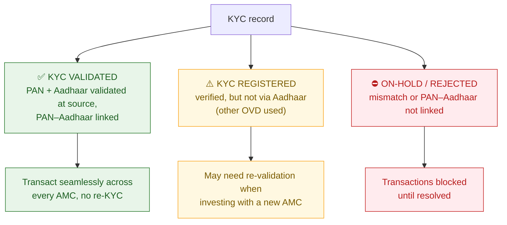

# M5 · The Investor Journey — Registration to Statements

!!! abstract "Learning objectives"
    By the end of this module you will be able to:

    - Walk the **full journey** from first registration to ongoing statements, and know what happens at each step.
    - Complete **KYC** correctly and read its three statuses (**Validated / Registered / On-Hold**) under the 2026 Aadhaar-PAN regime.
    - Set up a **folio**, a **first purchase**, a **nominee** (up to 10) and an **SIP mandate**, and know the **cut-off-time / applicable-NAV** rule that decides *which day's NAV* you get.
    - Track holdings via the **Consolidated Account Statement (CAS)** and **MF Central**, and recover lost folios via **MITRA**.

This is the last **Foundations** module. M1–M4 told you *what* a fund is, *who* runs it, *which kinds* exist and *what they cost*. M5 is the *how-to*: the actual mechanics of becoming and staying an investor.

---

## 1. Intuition first — friction is front-loaded, then it's automatic

The investor journey has an unusual shape: **almost all the effort is at the start.** Getting KYC done and a folio opened is a one-time chore. After that, a well-set-up investor does almost nothing — an SIP mandate pulls money automatically each month, statements arrive on their own, and the portfolio compounds in the background. The single most valuable thing this module can do is get you cleanly **through** the front-loaded friction, because that friction is where most people stall, delay, and lose years of compounding.

---

## 2. Stage 1 — KYC: the one-time identity gate

You cannot buy any SEBI-regulated product until you are **KYC-compliant**. KYC (*Know Your Customer*) is a one-time identity-and-address verification, recorded centrally so it works across all fund houses.

!!! note "Definition — CKYC & KRA"
    Your KYC record lives in a **central registry** (CKYC, run by CERSAI) and with **KYC Registration Agencies (KRAs)** such as CAMS-KRA. Once done with *any* SEBI intermediary, it is reusable everywhere — you do not redo KYC per AMC.

### The three KYC statuses you must understand

From **1 April 2026**, SEBI mandates **Aadhaar + PAN authentication** for KYC validation. Your record carries one of three statuses, and the difference is practical:



- **KYC Validated** — the gold standard: PAN, Aadhaar (and contact details) validated at source and PAN–Aadhaar linked. You transact **seamlessly across all AMCs**, no repeat KYC.
- **KYC Registered** — verified, but not fully through Aadhaar (e.g. another Officially Valid Document was used). It works, but a **new AMC may ask you to re-validate**.
- **On-Hold / Rejected** — a mismatch, or **PAN not linked to Aadhaar**. **Transactions are blocked** until you fix it. This is the single most common reason a first investment fails.

!!! tip "Do this first"
    Check your KYC status (on any KRA or MF Central) **before** you try to invest, and ensure your **PAN is linked to Aadhaar**. Aim for **Validated**. Five minutes here saves a blocked transaction later.

---

## 3. Stage 2 — Opening a folio and the first purchase

With KYC done, you open a **folio** (your account number with a fund house — see [**M2**](m02-ecosystem.md)) and place your first purchase. You can do this **direct** (AMC website / MF Central / RIA platform → *direct* plan) or via a distributor/app (→ *regular* plan). Recall from [**M4**](m04-cost-and-plans.md) that the plan choice is the costliest decision here.

### The rule that decides *which day's NAV* you get

You do not always get *today's* NAV. The **cut-off time** and **fund realisation** govern the **applicable NAV**:

!!! note "Definition — Cut-off time & applicable NAV"
    - **Equity & debt funds (non-liquid):** for a purchase, you get a business day's NAV **only if the money is actually credited to the scheme's account (realised) before the 3:00 pm cut-off** that day — *regardless of amount*. Money realised later → next business day's NAV.
    - **Liquid & overnight funds:** purchase cut-off is **1:30 pm**, and you may get the **previous day's** NAV if funds are realised in time.
    - **Redemptions:** **3:00 pm** cut-off for most schemes.

### Worked example 1 — the NAV your money actually gets

You place a **₹1,00,000** lump sum in an equity fund at **2:00 pm** on Monday, but the bank transfer only **credits the scheme account at 6:00 pm Monday**. Because the money was **not realised before 3:00 pm**, you get **Tuesday's** NAV, not Monday's. If Tuesday's NAV is ₹250.00, you receive 1,00,000 ÷ 250 = **400 units**. The lesson: for time-sensitive lump sums, ensure funds **realise** before cut-off — the *order* time is not what counts, the *credit* time is.

---

## 4. Stage 3 — Nomination (the step everyone skips)

A **nominee** is the person who can claim your units if you die — the bridge that stops your investment becoming "unclaimed". SEBI overhauled nomination from **1 March 2025**:

- You may name **up to 10 nominees**, each with a **percentage** share.
- Nomination must be done **personally** — a Power-of-Attorney holder **cannot** do it for you.
- You may formally **opt out** of nomination by a signed declaration, but you must make an active choice.
- The framework also covers **incapacitation** (a nominee operating the account if you are alive but incapacitated), not only death.

!!! danger "Why this matters more than it seems"
    Crores of rupees sit in **unclaimed** folios because investors never named a nominee and heirs couldn't trace or claim them. Naming a nominee (or consciously opting out) is a two-minute act that prevents your wealth becoming a legal tangle for your family.

---

## 5. Stage 4 — Automating with an SIP mandate

To run an **SIP** (the automatic monthly investment from [**M1**](m01-what-is-a-fund.md)), you authorise a **mandate** — a standing instruction that lets the AMC pull a capped amount from your bank each month.

!!! note "Definition — e-mandate (NACH / UPI AutoPay)"
    A one-time bank authorisation, set up via **NACH** or **UPI AutoPay**, permitting auto-debit **up to a stated ceiling**. The ceiling can be higher than your SIP (e.g. a ₹25,000 ceiling for a ₹5,000 SIP) so you can step up later without re-registering.

### Worked example 2 — a clean SIP setup

You register a ₹5,000 monthly SIP on the 5th, with an e-mandate ceiling of ₹25,000. The **first instalment** may take a few business days for the mandate to activate; thereafter, every month on (or around) the 5th, ₹5,000 is pulled automatically, units are allotted at that day's applicable NAV, and the RTA updates your folio — **no action from you**. This automation, sustained for years, is the engine of rupee-cost averaging ([**M1**](m01-what-is-a-fund.md)) and the four lifecycle decisions you'll meet in [**M6**](m06-lifecycle-decisions.md).

---

## 6. Stage 5 — Statements and tracking

Once invested, the **RTA** keeps you informed (recall the "statements & folios" flow in [**M2**](m02-ecosystem.md)):

!!! note "Definition — CAS (Consolidated Account Statement)"
    A single statement, generated by the depositories/RTAs, showing **all** your mutual-fund (and demat) holdings across AMCs in one place. A **transaction CAS** is issued for the month in which you transact; a **half-yearly CAS** summarises holdings even if you didn't. **MF Central** (the joint CAMS-KFintech investor portal) lets you view and manage holdings across all fund houses in one login.

What to actually monitor (the *light* version; the analyst version is **M9–M13**): that your SIPs are going through, your units and value are updating, your contact details and nominee are current, and your KYC stays Validated.

---

## 7. Stage 6 — When something goes wrong: grievance & tracing

Two safety nets close the journey:

- **Grievance** — escalate **AMC → SCORES → ODR**, in that order (detailed in [**M2**](m02-ecosystem.md) §6).
- **MITRA (Mutual Fund Investment Tracing and Retrieval Assistant)** — a SEBI service (Feb 2025), hosted jointly by **CAMS and KFintech** and reachable via **MF Central, AMFI, the QRTAs and SEBI**, that helps you **trace inactive or unclaimed folios** — old investments forgotten, lost to outdated KYC, or left by a deceased relative.

---

## 8. The whole journey in one picture

```mermaid
sequenceDiagram
    participant You as Investor
    participant KRA as KYC / KRA
    participant AMC as AMC / Platform
    participant RTA as RTA (CAMS/KFintech)
    You->>KRA: Complete CKYC (PAN + Aadhaar) → aim for "Validated"
    KRA-->>You: KYC status confirmed
    You->>AMC: Open folio · choose Direct/Regular · add nominee(s)
    You->>AMC: First purchase / register SIP e-mandate
    Note over AMC: Applicable NAV by cut-off & fund realisation
    AMC->>RTA: Allot units; record folio
    RTA-->>You: Account statement / CAS
    loop Every month
        AMC->>You: Auto-debit SIP → units allotted → folio updated
    end
    Note over You,RTA: Lost a folio? → trace via MITRA
```

---

## 9. Common mistakes & Do's and Don'ts

!!! danger "Onboarding traps"
    1. **PAN not linked to Aadhaar** → KYC **On-Hold** → first investment **blocked**. Fix linking *before* investing.
    2. **Skipping the nominee** → risk of an **unclaimed**, hard-to-recover folio for your heirs.
    3. **Assuming the order time = your NAV** → it's the **realisation time vs cut-off** that decides the day's NAV.
    4. **Scattering money across many folios/AMCs** → harder to track; use **MF Central / CAS** to consolidate the view.
    5. **Letting KYC drift to "Registered"** → a new AMC may force re-validation mid-investment.

!!! success "Do"
    - **Do** get KYC to **Validated** and **PAN–Aadhaar linked** first.
    - **Do** add **nominees** (or consciously opt out) at folio creation.
    - **Do** set an e-mandate **ceiling above** your SIP so you can step up later.
    - **Do** use **CAS / MF Central** for a single consolidated view.

!!! failure "Don't"
    - **Don't** rush a lump sum near cut-off without ensuring funds **realise** in time.
    - **Don't** ignore a "Registered" or "On-Hold" KYC status.

---

## 10. Applicable SEBI (Mutual Funds) Regulations, 2026

- **KYC / Aadhaar-PAN authentication** — mandatory validation regime (Validated/Registered/On-Hold) effective **1 Apr 2026**; PAN–Aadhaar linkage required. *[verify circular ref & section no.]*
- **Nomination framework** — up to **10 nominees**, personal nomination only, opt-out by declaration, incapacitation provisions (effective **1 Mar 2025**). *[verify]*
- **Cut-off timing & applicable NAV** — units allotted at NAV determined by **fund realisation** before cut-off, for all purchases (ex-liquid/overnight specifics). *[verify]*
- **Investor statements (CAS)** — periodic consolidated statements to unit-holders. *[verify]*
- **MITRA** — SEBI service platform (Feb 2025) to trace inactive/unclaimed folios via the QRTAs. *[verify circular ref]*

(KYC and grievance infrastructure as part of the wider 2026 investor-protection push is revisited in [**M18**](m18-sebi-regulations-2026.md) and [**M19**](m19-problems-investors.md).)

---

## 11. Key takeaways

!!! quote "Key takeaways"
    - The journey is **friction up front, automation after** — clearing KYC and folio setup is the hard part.
    - Get KYC to **Validated** with **PAN–Aadhaar linked**; "On-Hold" blocks you.
    - You can name **up to 10 nominees**, personally — do it (or opt out consciously).
    - The day's **NAV depends on fund realisation vs cut-off**, not your order time.
    - Track everything via **CAS / MF Central**; recover lost folios via **MITRA**; escalate grievances **AMC → SCORES → ODR**.

---

## 12. A word from the field

!!! quote "On letting the setup work"
    *"The first rule of compounding: never interrupt it unnecessarily."*

    — **Charlie Munger**, Vice-Chairman of Berkshire Hathaway. The whole point of getting the journey set up cleanly — KYC, folio, nominee, an automatic SIP — is so that compounding can run **uninterrupted** for decades. The setup is friction; the reward is never having to touch it again.
