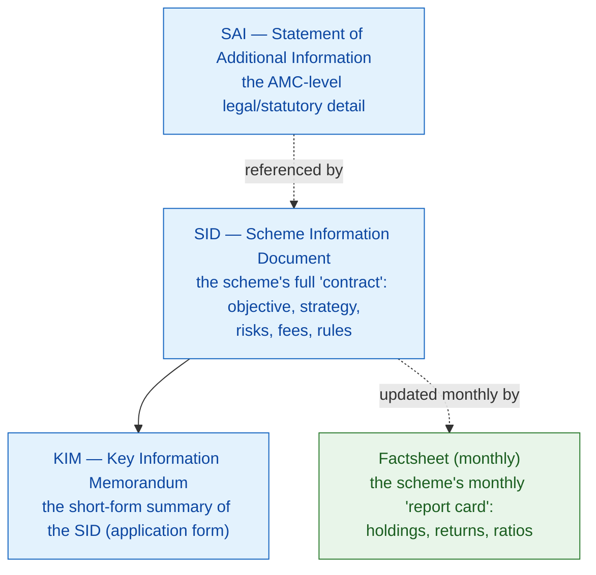

# M7 · Reading a Factsheet & SID Like a Professional

!!! abstract "Learning objectives"
    By the end of this module you will be able to:

    - Tell apart the **four documents** a fund publishes — **SID, KIM, SAI, and the monthly factsheet** — and know what each is *for*.
    - Read every line of a **factsheet**: benchmark, riskometer, AUM, manager tenure, expense ratio, holdings, concentration, allocation, and the ratios.
    - Interpret **debt-specific** disclosures — **YTM, duration, the PRC matrix, credit profile** — at a beginner level.
    - Read **returns correctly** (point-to-point vs rolling, vs the right **TRI benchmark**) and spot the **red flags**.

Builds on [**M3**](m03-taxonomy.md) (categories), [**M4**](m04-cost-and-plans.md) (cost) and [**M6**](m06-lifecycle-decisions.md) (decisions). This is where you learn to judge a fund from its *documents* rather than its advertising. The heavy ratio math (Sharpe, alpha, duration analytics) is only *introduced* here and fully built in **M9–M11**.

---

## 1. Intuition first — read the report card, not the poster

Every fund publishes, by law, a set of documents. An advertisement shows you a fund's best face; the **factsheet and the Scheme Information Document (SID)** show you what it actually holds, what it costs, what it benchmarks against, and how risky it is. Learning to read them is the difference between *being sold* a fund and *choosing* one. The good news: factsheets are standardised, so once you can read one, you can read all of them.

---

## 2. The four documents and what each is for

- **SID (Scheme Information Document)** — the scheme's full legal document: investment **objective**, strategy, asset allocation ranges, **risk factors**, fees, load structure, and rules. Your binding "contract" with the scheme. The 2026 reforms **simplified and shortened** these documents.
- **KIM (Key Information Memorandum)** — the SID's short-form summary, attached to the application form.
- **SAI (Statement of Additional Information)** — AMC-level statutory information (the trustees, auditors, procedures), referenced by every SID.
- **Factsheet** — the **monthly** report card: current holdings, allocation, returns and ratios. This is what you read regularly; the SID is what you read once, before buying.

!!! tip "Which to read when"
    **Before buying:** read the **SID** (objective, risk, load, mandate). **While holding:** read the **factsheet** monthly (holdings, returns, ratios, any drift).

---

## 3. Anatomy of a factsheet — an annotated walkthrough

Below is an **illustrative** (not real) factsheet for a fictional *"Illustrative Flexi Cap Fund — Direct, Growth"*, annotated line by line.

| Factsheet line | Illustrative value | What it tells you |
|---|---|---|
| **Category** | Flexi Cap | The mandate rules from [**M3**](m03-taxonomy.md) (≥65% equity, any cap mix). |
| **Investment objective** | Long-term growth, flexible market-cap | Must match *your* goal/horizon. |
| **Benchmark (Tier-1)** | **Nifty 500 TRI** | The yardstick. Must be a **Total Return Index** (see §5). |
| **Riskometer** | **Very High** | SEBI's 6-level risk label (Low → Very High). |
| **Inception date** | Jan 2013 | Length of live track record (~13 yrs). |
| **AUM** | ₹18,450 cr | Fund size; affects agility and cost slab ([**M4**](m04-cost-and-plans.md)). |
| **Fund manager (tenure)** | "A. Sharma" — since 2016 (~10 yrs) | *Who* runs it and for how long; a recent manager change weakens the track record's relevance. |
| **Expense ratio** | Direct **0.78%** / Regular **1.62%** | Cost — read post-2026 as BER + add-ons ([**M4**](m04-cost-and-plans.md)). |
| **No. of stocks** | 58 | Diversification breadth. |
| **Top-10 concentration** | 41% of portfolio | How concentrated the bets are. |
| **Market-cap split** | Large 68% / Mid 21% / Small 11% | The fund's *real* risk posture (a flexi-cap's choice). |
| **Sector allocation** | Financials 28%, IT 14%, … | Where the active bets are. |
| **Portfolio turnover** | 38% | How much trading the manager does (see §4). |
| **Std dev / Beta / Sharpe** | 13.2% / 0.92 / 0.71 | Risk & risk-adjusted return — *introduced* here, computed in [**M9**](m09-risk-adjusted-performance.md). |

### How to actually read it (the order that matters)

1. **Does the category and objective match my goal and horizon?** (If not, stop — nothing else matters.)
2. **Is the benchmark a TRI, and how has the fund done *against it*** over 3/5/10 years and rolling? (Beating the fund's own past is meaningless; beating its **benchmark** is the test.)
3. **What is the real risk posture** — riskometer, market-cap split, top-10 concentration, sector bets?
4. **What does it cost** (direct TER), and **who runs it, for how long**?
5. **Only then**, the ratios.

### Worked example 1 — concentration tells a story

Two flexi-cap funds both returned ~16% over five years. Fund A holds **58 stocks, top-10 = 41%**; Fund B holds **28 stocks, top-10 = 64%**. Same return, *very* different risk: Fund B's result rode on a few large bets — higher potential, higher fragility. The factsheet's concentration lines reveal what the headline return hides. (Whether B's extra risk was *rewarded* is the Sharpe/alpha question of **M9–M10**.)

---

## 4. Debt-fund disclosures — three numbers and a matrix

A debt fund's factsheet replaces market-cap and sector lines with **credit and duration** disclosures (full analytics in [**M11**](m11-portfolio-internals-debt.md)). Read four things:

!!! note "Definitions — the debt factsheet vitals"
    - **YTM (Yield to Maturity)** — the annualised return if all holdings are held to maturity; a rough *gross* indicator of the income the portfolio can generate (before TER and defaults).
    - **Macaulay / Modified duration** — the portfolio's **interest-rate sensitivity**: a modified duration of 1.6 means a 1% rise in rates cuts NAV ~1.6%. Longer = more rate risk.
    - **Credit profile** — the split by rating (e.g. AAA 72% / AA 23% / A 5%); lower-rated = higher yield *and* higher default risk.
    - **PRC (Potential Risk Class) matrix** — a SEBI grid placing the scheme by **max interest-rate risk (Class A/B/C)** × **max credit risk (Class I/II/III)**. It caps how much risk the fund is *allowed* to take.

### The PRC matrix at a glance

| | Credit Risk I (lowest) | Credit Risk II | Credit Risk III (highest) |
|---|---|---|---|
| **Interest-rate Class A (lowest)** | A-I | A-II | A-III |
| **Interest-rate Class B** | B-I | **B-II ← example fund** | B-III |
| **Interest-rate Class C (highest)** | C-I | C-II | C-III |

### Worked example 2 — reading a short-duration fund

A short-duration fund shows **YTM 7.6%, Modified duration 1.6, AAA 72% / AA 23% / A 5%, PRC = B-II**. Reading it: it can earn ~7.6% gross if nothing defaults; a 1% rate rise would knock ~1.6% off NAV (modest); roughly a quarter of the book is below AAA (some credit risk); and the **B-II** label legally caps it at moderate rate-and-credit risk. A sensible 1–3 year parking choice — *not* a substitute for a liquid fund or an FD.

---

## 5. Reading returns honestly

Two traps live in the returns table:

- **Point-to-point vs rolling returns.** A "5-year return of 19%" is one *lucky window* (point-to-point). **Rolling returns** (the average of all 5-year windows) show *consistency* — far more trustworthy. Prefer rolling.
- **The benchmark must be a TRI.** A **Total Return Index** includes dividends; comparing a fund against a price-only index flatters the fund. Since SEBI's mandate, funds benchmark against **TRI** and often a **two-tier benchmark** (Tier-1 broad category index; Tier-2 a more specific index).

!!! note "Definition — Total Return Index (TRI)"
    An index that assumes **dividends are reinvested**, so it reflects the *full* return of holding the index. Benchmarking against TRI is the honest test — it is the return you could have earned passively, dividends included.

---

## 6. Red flags to catch on any factsheet

!!! danger "Warning signs"
    1. **Recent manager change** — a long track record means little if the person who built it just left.
    2. **Mandate drift** — a "large-cap" fund heavy in mid/small caps (a true-to-label breach, [**M3**](m03-taxonomy.md)).
    3. **Soaring AUM in a small/mid-cap fund** — size can blunt agility; watch the stress-test/liquidity disclosure.
    4. **High portfolio turnover with no outperformance** — lots of trading (and cost) for nothing.
    5. **Benchmark that isn't a TRI, or cherry-picked point-to-point windows** in marketing.
    6. **Rising credit risk in a debt fund** (drifting from AAA toward lower ratings to chase YTM).

---

## 7. Common mistakes & Do's and Don'ts

!!! danger "Misreadings"
    1. **Judging a fund by its own past, not its benchmark.** Beating itself is automatic; beating the **TRI** is the test.
    2. **Reading point-to-point returns as typical.** Use **rolling** returns.
    3. **Ignoring the riskometer / PRC** because the return looked good.
    4. **Treating a high YTM as "more return"** — it often signals **more credit risk**, not free yield.

!!! success "Do"
    - **Do** read the **SID before buying**, the **factsheet monthly** after.
    - **Do** compare returns to the **TRI benchmark** and prefer **rolling** returns.
    - **Do** check **manager tenure, concentration, and (for debt) PRC + credit profile**.

!!! failure "Don't"
    - **Don't** chase a high YTM or a single lucky return window.
    - **Don't** skip the riskometer and asset-allocation lines.

---

## 8. Applicable SEBI (Mutual Funds) Regulations, 2026

- **Standardised scheme documents** — SID, KIM and SAI in prescribed formats; **2026 simplification/shortening** of these documents. *[verify section no.]*
- **Benchmarking** — **two-tier**, **Total Return Index** benchmarks for performance disclosure. *[verify circular ref]*
- **Riskometer & product labelling** — mandatory 6-level riskometer; **PRC matrix** for debt schemes. *[verify]*
- **Portfolio & performance disclosure** — periodic portfolio disclosure (monthly/fortnightly for debt), and standardised return reporting; **stress-testing/liquidity** disclosure for mid/small-cap schemes. *[verify]*
- **True-to-label** — the basis for spotting mandate drift on a factsheet ([**M3**](m03-taxonomy.md)). *[verify]*

(Full disclosure architecture and the compliance timeline are in [**M18**](m18-sebi-regulations-2026.md).)

---

## 9. Key takeaways

!!! quote "Key takeaways"
    - **SID = the contract (read before buying); factsheet = the monthly report card (read while holding).**
    - Read a factsheet in order: **objective/category → return vs TRI benchmark → risk posture → cost → manager → ratios.**
    - **Concentration, manager tenure and market-cap split** reveal risk the headline return hides.
    - For debt, read **YTM, duration, credit profile and the PRC class** — a high YTM usually means more **credit risk**.
    - Trust **rolling returns vs a TRI**, not point-to-point windows; watch for **manager change and mandate drift**.

---

## 10. A word from the field

!!! quote "On doing the homework"
    *"Investment is most intelligent when it is most businesslike."*

    — **Benjamin Graham**, *The Intelligent Investor* (a line Warren Buffett calls the most important words ever written about investing). Reading the SID and factsheet *is* the businesslike act: you are inspecting the product's books before committing capital, rather than buying on a story.
