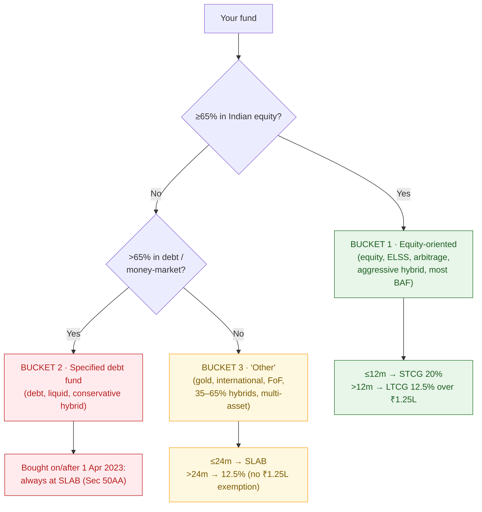

# M8 · Taxation

!!! abstract "Learning objectives"
    By the end of this module you will be able to:

    - Place any fund into the **three tax buckets** (equity-oriented / specified-debt / "other") and apply the correct rate and holding period.
    - Compute **STCG and LTCG** on equity funds, including the **₹1.25 lakh** annual exemption, at mid-2026 rates.
    - Apply the **Section 50AA** slab treatment to post-April-2023 debt funds, and the **24-month / 12.5%** rule to gold, international and other funds.
    - Tax **IDCW**, understand why an **SWP** is more tax-efficient, and remember that a **switch is a taxable event**.

!!! info "Currency"
    All rates are current to **mid-2026 (FY 2026-27 / AY 2027-28)**. Budget 2025 made **no change** to these capital-gains rules. Tax is personal — figures illustrate the mechanics; consult a tax adviser for your situation. (This is information, not tax advice.)

Builds on [**M3**](m03-taxonomy.md) (a fund's category determines its tax) and [**M6**](m06-lifecycle-decisions.md) (switch/exit decisions carry tax friction). Tax mechanics here feed the **tax-aware exit calculus** of [**M14**](m14-tax-aware-exit.md).

---

## 1. Intuition first — tax follows what the fund *holds*, not its name

The single rule that organises everything: **a fund is taxed by what it predominantly holds, and by how long you held it.** "Equity-oriented" (mostly Indian shares) gets the friendliest treatment; "debt" gets the harshest (since 2023); everything in between sits in a third bucket. Get the **bucket** right first, then the **holding period**, then the **rate**.

---

## 2. Bucket 1 — Equity-oriented funds (≥65% Indian equity)

The friendliest bucket. Includes pure equity funds, **ELSS**, **arbitrage** funds, **aggressive hybrids**, and **balanced-advantage/equity-savings** funds that keep ≥65% equity.

!!! note "Equity fund capital-gains rates (mid-2026)"
    - **Short-term (held ≤ 12 months)** — **STCG 20%** (Section 111A; raised from 15% on 23 July 2024).
    - **Long-term (held > 12 months)** — **LTCG 12.5%** on gains **above ₹1.25 lakh per financial year** (Section 112A). The first ₹1.25 lakh of LTCG each year is **exempt**.
    - **STT** (Securities Transaction Tax) applies on redemption; a 4% **health & education cess** (and surcharge where applicable, LTCG surcharge capped at 15%) sits on top of the rates above.

### Worked example 1 — equity LTCG with the exemption

You invest **₹5,00,000**, redeem after **3 years** at **₹8,00,000**. Gain = **₹3,00,000** (long-term).

$$\text{Taxable LTCG} = 3{,}00{,}000 - 1{,}25{,}000\ (\text{exemption}) = 1{,}75{,}000$$
$$\text{Tax} = 1{,}75{,}000 \times 12.5\% = ₹21{,}875\quad(+\,4\%\ \text{cess} \Rightarrow ₹22{,}750)$$

Your effective tax on a ₹3 lakh gain is ~7.6% — the exemption plus the low LTCG rate make long-held equity highly tax-efficient.

### Worked example 2 — equity STCG

Same fund, but you redeem after **10 months** with a **₹50,000** gain (short-term):

$$\text{Tax} = 50{,}000 \times 20\% = ₹10{,}000\ (+\text{cess})$$

No ₹1.25 lakh exemption applies to STCG. The lesson from [**M6**](m06-lifecycle-decisions.md) is now visible in rupees: holding past 12 months drops the rate from 20% to 12.5% *and* unlocks the exemption — a powerful reason not to churn.

!!! tip "Tax-harvesting the ₹1.25 lakh exemption"
    Because the LTCG exemption is **per financial year**, long-term investors can redeem and immediately re-buy to "harvest" up to ₹1.25 lakh of gains tax-free each year, resetting their cost base. Useful, but mind exit loads, the re-buy NAV, and that it only helps long-term equity gains. (Detailed in [**M14**](m14-tax-aware-exit.md).)

---

## 3. Bucket 2 — Specified debt funds (>65% debt), post-April-2023

The harshest bucket, after a structural 2023 change.

!!! note "Section 50AA — specified mutual funds"
    A **"specified mutual fund"** invests **more than 65%** in debt/money-market instruments (debt funds, liquid funds, most conservative hybrids). For units **acquired on or after 1 April 2023**, **all** gains are taxed at your **income-tax slab rate**, **regardless of holding period** — there is **no LTCG rate and no indexation**. (Units bought *before* 1 April 2023 retain older treatment: >24 months → 12.5% without indexation post-July-2024.)

### Worked example 3 — a debt fund bought in 2024

You invest **₹2,00,000** in a debt fund in 2024, redeem after **3 years** at **₹2,40,000**. Gain = **₹40,000**. If you are in the **30% slab**:

$$\text{Tax} = 40{,}000 \times 30\% = ₹12{,}000\ (+\text{cess})$$

The 3-year holding earns *no* concession — the gain is taxed exactly as salary would be. This is the change that **erased debt funds' old tax edge over fixed deposits**, reshaping how HNIs and institutions allocate (a structural fact we return to in [**M16**](m16-archetypes-pms-aif.md)).

---

## 4. Bucket 3 — "Other" funds (gold, international, FoF, 35–65% hybrids)

Funds that are **neither** ≥65% Indian equity **nor** >65% debt — **gold funds, international/overseas funds, fund-of-funds, multi-asset and 35–65% hybrids** — sit in a middle bucket:

!!! note "'Other' fund rates (mid-2026)"
    - **Short-term (held ≤ 24 months)** — taxed at **slab**.
    - **Long-term (held > 24 months)** — **12.5% without indexation**.
    - **No ₹1.25 lakh exemption** (that is only for equity-oriented Section 112A funds).

### Worked example 4 — a gold or international fund

You invest **₹3,00,000** in a gold fund, redeem after **30 months** at **₹4,00,000**. Gain = **₹1,00,000** (long-term, >24m):

$$\text{Tax} = 1{,}00{,}000 \times 12.5\% = ₹12{,}500\ (+\text{cess})$$

Had you sold at **18 months**, the whole ₹1,00,000 would be taxed at your **slab** — so the **24-month line** matters a lot for this bucket. Note there is **no ₹1.25 lakh exemption** here, unlike equity.

---

## 5. IDCW, SWP and the switch — three things people get wrong

### 5.1 IDCW is taxed at your slab

The **IDCW** payout (the old "dividend", [**M1**](m01-what-is-a-fund.md)) is **added to your income and taxed at your slab rate**. The fund deducts **TDS at 10%** once IDCW from a single fund crosses the annual threshold (**₹10,000** from FY 2025-26) *[verify threshold]*. Combined with the fact that IDCW is just your own capital returned (NAV falls by the payout), this makes IDCW **tax-inefficient** for most investors.

### 5.2 SWP is far more tax-efficient than IDCW

An **SWP** (systematic withdrawal, [**M6**](m06-lifecycle-decisions.md)) is treated as a **redemption**, so **only the capital-gain portion** of each withdrawal is taxed — not the whole amount.

### Worked example 5 — SWP vs IDCW for ₹50,000 of monthly income

You hold **₹10,00,000** (cost ₹8,00,000, so the corpus is 20% gain). You want **₹50,000**:

- **Via IDCW:** the entire **₹50,000** is income, taxed at your slab (say 30%) → **₹15,000** tax.
- **Via SWP:** of the ₹50,000 withdrawn, only ~**20% (₹10,000)** is gain; the rest is your own capital. If it's long-term equity, that ₹10,000 may even fall within the ₹1.25 lakh exemption → **₹0–₹1,250** tax.

Same cash in hand, a fraction of the tax. **For regular income, prefer an SWP over IDCW.**

### 5.3 A switch is a taxable event

Switching from Fund A to Fund B (or regular→direct, or between schemes) is a **redemption of A + purchase of B** — it **realises capital gains on A** and may trigger an **exit load**. This is the friction [**M6**](m06-lifecycle-decisions.md) warned about and [**M14**](m14-tax-aware-exit.md) quantifies: never switch on a whim without counting the tax.

---

## 6. ELSS and the 80C question under the new regime

**ELSS** (Equity-Linked Savings Scheme, [**M3**](m03-taxonomy.md)) offers a deduction of up to **₹1.5 lakh under Section 80C** — but **only under the OLD tax regime**. Under the **new regime (now the default)**, there is **no 80C deduction**, so ELSS loses its tax-saving rationale and becomes just an equity fund with a **3-year lock-in**. Whether ELSS still makes sense depends entirely on which regime you are in.

!!! warning "Check your regime first"
    If you are on the **new regime**, ELSS gives you **no deduction** — don't buy it *for tax saving*. If on the **old regime**, ELSS is the shortest-lock-in 80C option. The regime choice comes first.

---

## 7. The whole tax picture in one table

| Fund type | Bucket | Short-term | Long-term | LT threshold | ₹1.25L exemption? |
|---|---|---|---|---|---|
| Equity, ELSS, arbitrage, ≥65% hybrid | 1 | 20% (≤12m) | 12.5% (>12m) | 12 months | **Yes** |
| Debt/liquid (bought ≥ Apr 2023) | 2 | **Slab (any period)** | — | — | No |
| Gold, international, FoF, 35–65% hybrid | 3 | Slab (≤24m) | 12.5% (>24m) | 24 months | No |

*(All + 4% cess; surcharge where applicable. IDCW always at slab with TDS.)*

---

## 8. Common mistakes & Do's and Don'ts

!!! danger "Tax traps"
    1. **Assuming all "hybrid" funds are equity-taxed.** Only ≥65%-equity hybrids are; a conservative hybrid may be debt-taxed (Bucket 2).
    2. **Expecting LTCG benefit on a post-2023 debt fund.** There is none — it's slab, always.
    3. **Treating IDCW as efficient income.** It's taxed at slab and is your own capital; an **SWP** is better.
    4. **Forgetting a switch is taxable.** Chasing a marginally better fund can cost more in tax than it gains.
    5. **Buying ELSS for tax saving on the new regime** — no deduction there.
    6. **Wasting the ₹1.25L exemption** by never harvesting it.

!!! success "Do"
    - **Do** identify the **bucket** before estimating tax.
    - **Do** hold equity **past 12 months** to get 12.5% + the exemption.
    - **Do** use an **SWP** for income and **harvest** the ₹1.25L exemption yearly.

!!! failure "Don't"
    - **Don't** churn equity inside 12 months without a strong reason (20% STCG).
    - **Don't** ignore tax when switching funds.

---

## 9. Applicable law & SEBI (Mutual Funds) Regulations, 2026

Taxation lives in the **Income-tax Act** (Sections **111A, 112A, 50AA**), not the SEBI Regulations — but the Regulations supply the **definitions** the tax law relies on:

- **Equity-oriented (≥65%) classification** and **categorisation** ([**M3**](m03-taxonomy.md)) determine which tax bucket a fund falls into. *[verify cross-reference]*
- **True-to-label** ensures a fund's stated equity/debt mix — and therefore its tax treatment — is real. *[verify]*
- **Specified mutual fund (>65% debt)** under Sec 50AA keys off the same portfolio-composition rules SEBI mandates.
- Income-tax provisions: **Sec 111A** (equity STCG 20%), **Sec 112A** (equity LTCG 12.5% over ₹1.25L), **Sec 50AA** (specified funds at slab), **Sec 194K** (IDCW TDS). *[verify TDS threshold for FY 2026-27]*

---

## 10. Key takeaways

!!! quote "Key takeaways"
    - Tax follows **what the fund holds** → put it in **Bucket 1 (equity) / 2 (specified debt) / 3 (other)** first.
    - **Equity:** STCG 20% (≤12m); LTCG **12.5% over a ₹1.25L yearly exemption** (>12m).
    - **Specified debt (post-Apr-2023):** **always slab** — no LTCG, no indexation (Sec 50AA).
    - **Other (gold/international/FoF):** slab ≤24m, **12.5% >24m**, no exemption.
    - **SWP beats IDCW** on tax; a **switch is a taxable event**; ELSS 80C only helps on the **old regime**.

---

## 11. A word from the field

!!! quote "On certainty"
    *"In this world nothing can be said to be certain, except death and taxes."*

    — **Benjamin Franklin**, letter to Jean-Baptiste Le Roy, 1789. Since the tax is certain, the intelligent move is not to avoid it but to **arrange holdings tax-efficiently** — hold equity long, prefer SWP to IDCW, mind the buckets — so that more of a given return is *kept*.
