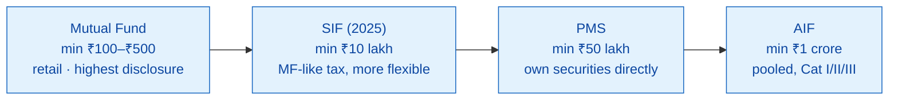

# M16 · Investor Archetypes & the PMS / AIF / SIF Adjacency

!!! abstract "Learning objectives"
    By the end of this module you will be able to:

    - Describe how **retail, HNI, family-office and institutional** investors use the *same* product shelf very differently — by scale, vehicle, exposure and constraint.
    - Explain two structural facts: **individuals drive equity flows; institutions dominate debt** — and how the **2023 debt-tax change** reshaped allocation.
    - Distinguish **Mutual Fund vs SIF vs PMS vs AIF** on minimums, structure, ownership, disclosure, **taxation** and liquidity.
    - Know *why* a key tax advantage favours pooled MFs over PMS — and where the higher-minimum vehicles genuinely fit.

Builds on the archetypes table from the seed material, plus [**M8**](m08-taxation.md) (tax) and [**M15**](m15-portfolio-construction.md) (construction). It frames the industry that [**M17**](m17-industry-economics.md) then analyses economically.

---

## 1. Intuition first — one shelf, four very different shoppers

A ₹5,000 SIP investor and a ₹500-crore pension fund buy from the **same** regulated shelf, but they use it like different species. As wealth and sophistication rise, investors **migrate up an adjacency ladder** — from mutual funds toward lighter-disclosure, higher-minimum, more-customised vehicles (SIF → PMS → AIF). Understanding *who* sits where explains both industry flows and the products' design.

---

## 2. The four archetypes

| Dimension | Retail / Individual | HNI | Family Office | Institution |
|---|---|---|---|---|
| **Typical ticket** | ₹500–₹50,000 SIPs; small lump sums | ₹25 lakh–several crore | pooled family wealth, multi-crore | ₹10s–₹1,000s of crore |
| **Primary vehicles** | Regular/Direct MF, SIPs, ELSS | MF + **PMS** (₹50L) + **AIF** (₹1cr) + SIF | Direct mandates, PMS, AIF, MF | Direct, debt MFs, liquid, index |
| **Dominant exposure** | Equity & hybrid | Equity + structured debt, global | Diversified, long-horizon | **Debt-heavy** (treasury) |
| **Use of MFs** | Wealth creation, goals, tax | Wealth + tax structuring + diversification | One sleeve among many | Liquidity & mandated allocation |
| **Key constraints** | Behaviour, literacy, mis-selling risk | Tax efficiency, concentration, service | Governance, succession | Risk policy, regulatory limits, fiduciary duty |
| **Advisory model** | Distributor / DIY app / RIA | Private wealth desk, family office, RIA | In-house team + RIA | In-house treasury/CIO, consultants |

!!! note "Two structural facts worth emphasising"
    1. **Individuals now dominate equity and hybrid AUM, while institutions dominate debt.** So **retail behaviour drives equity flows** — retail is the swing factor in market stability, and the SIP book is the industry's ballast.
    2. **The HNI segment is migrating beyond plain mutual funds into PMS and AIFs** — a fast-growing adjacency under *lighter-disclosure, higher-minimum* regimes, where many of the same analytical tools (**M9–M14**) still apply.

---

## 3. The 2023 debt-tax change reshaped the map

Recall from [**M8**](m08-taxation.md) that debt funds bought on/after **1 April 2023** are taxed at **slab, with no LTCG benefit or indexation** (Sec 50AA). This **erased debt funds' old tax edge over fixed deposits**, and it **reshaped institutional and HNI allocation**:

- Money moved toward **arbitrage funds** (equity-taxed despite low risk), **equity-savings** and **hybrids** that *retain* equity taxation while delivering debt-like stability.
- It strengthened the case for **target-maturity** and direct-bond strategies for pure debt needs.

A tax rule, not a market move, redrew where large investors park money — a reminder that **tax structure is an allocation force**, not a footnote.

---

## 4. The adjacency ladder — MF → SIF → PMS → AIF

### 4.1 Mutual Fund — the baseline (recap)
Pooled; you own **units**; highest disclosure ([**M7**](m07-factsheet-sid.md)); true-to-label categories ([**M3**](m03-taxonomy.md)); lowest minimums; **deferred-tax advantage** (see §5). The retail default and the benchmark the others are judged against.

### 4.2 SIF — Specialized Investment Fund (new, 2025)
A **new SEBI asset class operational from April 2025**, sitting **between MFs and PMS**, with a **minimum of ₹10 lakh**. It permits more flexible strategies than a plain MF (e.g. long-short) under an MF-style regulated wrapper, and is **taxed like a mutual fund** (equity 20% STCG / 12.5% LTCG; debt at slab). It lowers the entry bar to sophisticated strategies that previously required ₹50 lakh+.

### 4.3 PMS — Portfolio Management Services
**Minimum ₹50 lakh.** Crucially, you **own the securities directly** in your own demat account (a *separate* account, not pooled units) — the manager runs a **customised** portfolio (discretionary or non-discretionary). More flexibility and personalisation, but **lighter disclosure, higher fees, and a major tax difference** (§5).

### 4.4 AIF — Alternative Investment Fund
**Minimum ₹1 crore.** Pooled private-investment vehicles in three categories:

- **Category I** — VC, SME, infrastructure, social-impact (economically desirable sectors).
- **Category II** — private equity, private debt, real-estate funds (the largest bucket).
- **Category III** — hedge-fund-style: long-short, complex/listed strategies, leverage.

Taxation differs by category (Cat I/II largely **pass-through**; **Cat III taxed at the fund level**), with long lock-ins and illiquidity.

---

## 5. The structural tax point — why pooling (MF) quietly wins

!!! tip "The deferred-tax advantage of a mutual fund"
    In a **mutual fund**, when the *manager* buys and sells inside the scheme, **you are not taxed** — gains accrue inside the NAV and you pay tax **only when *you* redeem** (**M8/M14**). In a **PMS**, you **own the securities directly**, so **every trade the manager makes is *your* taxable event**, realising capital gains in your hands *each time*. A high-churn PMS can generate a substantial annual tax drag that a similarly-churning mutual fund **defers for years**. This **tax deferral inside the pooled structure** is an underappreciated, durable edge of mutual funds over PMS for taxable investors.

### Worked example — the PMS churn tax drag

Two managers each run ₹1 crore and realise **₹15 lakh** of short-term gains by churning in a year.

- **Mutual fund:** that ₹15 lakh is realised *inside the scheme* — **you owe nothing** until you redeem; it keeps compounding pre-tax.
- **PMS:** the ₹15 lakh is realised in **your** hands → STCG at 20% = **₹3,00,000 tax this year**, money that leaves the portfolio and stops compounding.

Same strategy, very different after-tax outcome — purely from **structure**. The PMS must out-perform by enough to overcome this drag (a break-even logic identical to [**M14**](m14-tax-aware-exit.md)).

---

## 6. The comparison, at a glance

| | Mutual Fund | SIF | PMS | AIF |
|---|---|---|---|---|
| **Minimum** | ₹100–₹500 | ₹10 lakh | ₹50 lakh | ₹1 crore |
| **Structure** | Pooled units | Pooled units | **Direct ownership** (separate a/c) | Pooled |
| **Disclosure** | Highest | High (MF-like) | Lower | Lower |
| **Taxation** | On *your* redemption | Like MF | **Each manager trade taxed to you** | By category (I/II pass-through; III fund-level) |
| **Liquidity** | High (open-ended) | Moderate–high | Moderate | Low (lock-ins) |
| **Best for** | All retail; core wealth | Mass-affluent wanting flexible strategies | HNIs wanting customisation | HNIs/institutions seeking private/alt exposure |

---

## 7. Common mistakes & Do's and Don'ts

!!! danger "Adjacency traps"
    1. **Chasing PMS/AIF for status**, ignoring higher fees, illiquidity and the **tax-on-every-trade** drag.
    2. **Believing cherry-picked PMS/AIF return decks** — lighter disclosure means more survivorship and selection bias; demand consistent, audited, post-fee, post-tax numbers.
    3. **Locking into an AIF** without accounting for multi-year illiquidity and capital calls.
    4. **Assuming "exclusive" = "better"** — for many taxable investors a low-cost MF beats a high-churn PMS after tax.
    5. **Over-allocating to alternatives** beyond what liquidity needs allow.

!!! success "Do"
    - **Do** match the **vehicle to scale, liquidity need and tax** — not to prestige.
    - **Do** compare PMS/AIF on **post-fee, post-tax, consistent** track records.
    - **Do** value the MF's **deferred-tax, high-liquidity, high-disclosure** edge for core wealth.

!!! failure "Don't"
    - **Don't** ignore the **PMS churn tax drag** or AIF lock-ins.
    - **Don't** treat marketing exclusivity as evidence of returns.

---

## 8. Applicable regulations

- **Mutual funds** — SEBI (Mutual Funds) Regulations, 2026 (the spine of this whole program; [**M18**](m18-sebi-regulations-2026.md)).
- **SIF** — SEBI's **Specialized Investment Fund** framework (2024–25), operating under the MF-regulation umbrella; ₹10 lakh minimum. *[verify framework ref]*
- **PMS** — SEBI (Portfolio Managers) Regulations, 2020; ₹50 lakh minimum; direct-ownership model. *[verify]*
- **AIF** — SEBI (Alternative Investment Funds) Regulations, 2012; ₹1 crore minimum; Categories I/II/III. *[verify]*
- **Accredited-investor** framework may relax minimums/disclosures for qualified investors. *[verify]*

(PMS and AIF sit **outside** the MF Regulations; this module maps the adjacency, not the MF law itself.)

---

## 9. Key takeaways

!!! quote "Key takeaways"
    - The **same shelf** serves four archetypes very differently; **individuals drive equity flows, institutions dominate debt**.
    - The **2023 debt-tax change** pushed large investors toward arbitrage/hybrids/target-maturity — tax as an allocation force.
    - The ladder is **MF (₹100+) → SIF (₹10L) → PMS (₹50L) → AIF (₹1cr)**, rising in minimum and falling in disclosure/liquidity.
    - **MFs defer tax** (taxed only on your redemption); **PMS taxes every manager trade to you** — a durable structural edge for pooled funds.
    - Choose the vehicle by **scale, liquidity and tax**, judged on **post-fee, post-tax** evidence — not prestige.

---

## 10. A word from the field

!!! quote "On sophistication"
    *"Risk comes from not knowing what you are doing."*

    — **Warren Buffett**. The move up the adjacency ladder buys *flexibility and exclusivity* — but also complexity, illiquidity and hidden tax drag. For most taxable investors, the disciplined, transparent, tax-deferred mutual fund is not a consolation prize; it is often the rational choice.
