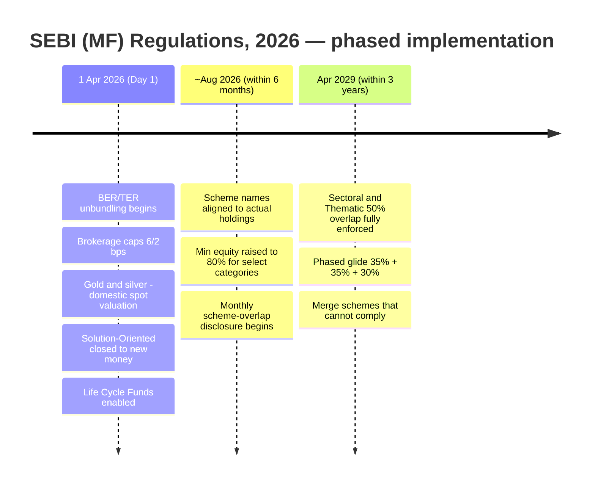

# M18 · The SEBI (Mutual Funds) Regulations, 2026 — In Depth

!!! abstract "Learning objectives"
    By the end of this module you will be able to:

    - State the **status and structure** of the SEBI (Mutual Funds) Regulations, 2026 and how they replace the 1996 framework.
    - Map the **regulatory architecture** (sponsor–trustee–AMC–custodian) and the **definitions** that drive the rest of the program (e.g. equity-oriented ≥65%).
    - Explain the **true-to-label / categorisation**, **BER/TER unbundling**, **brokerage-cap**, **governance/KMP**, **scheme-overlap** and **Life Cycle** provisions in one place.
    - Read the **phased compliance timeline — April 2026 → ~August 2026 → April 2029** — and know what changes when.

This is the **legal spine**. Every earlier module's "Applicable Regulations" box points here; this module consolidates and, where the primary text allows, resolves the `[verify section no.]` tags.

!!! info "Primary source"
    Drawn from the **SEBI (Mutual Funds) Regulations, 2026**, Gazette of India notification (Part III–Sec. 4), **No. 45, New Delhi, dated 14 January 2026**, on **sebi.gov.in**. Where a Regulation number is stated plainly it is taken from that text; where a provision is described without a number, it is real and in force but the exact clause in the renumbered text is tagged `[verify]` — never invented.

---

## 1. Intuition first — this is the source code

Everything you have learned has a legal root here. "True-to-label", the ₹1.25-lakh tax bucket, the direct plan, the riskometer, the custodian's independence — none are conventions; they are **enforceable rules**. Reading the law directly does two things: it lets you cite the *actual* basis for a claim, and it reveals the **regulator's intent** — overwhelmingly, in 2026, the intent is **transparency and cost-fairness**.

---

## 2. Status, structure and scale

!!! note "Key facts (verified)"
    - **Approved** by the SEBI Board on **17 December 2025**; **notified** in the Gazette on **14 January 2026**; **commencement 1 April 2026** (**Regulation 1(2)** — *"These regulations shall come into force on the 1st day of April, 2026"*).
    - **Replaces** the SEBI (Mutual Funds) Regulations, **1996** — the first wholesale overhaul in ~30 years.
    - **Simplified**: the rulebook was cut roughly **44%** (from ~162 to ~88 pages; ~67,000 → ~31,000 words) — itself a transparency measure.

The Regulations are organised into chapters: **preliminary & definitions** (Ch. I, **Regulations 1–2**), **registration** of mutual funds and AMCs, **constitution and management** (sponsor, trustees, AMC, custodian), **schemes**, **investment & valuation norms**, **general obligations**, and **inspection/penalties**, followed by **schedules**.

---

## 3. Regulatory architecture (the law behind M2)

!!! note "Constitution — three-tier trust"
    - A mutual fund is **constituted as a trust**; assets are held by **trustees** for unit-holders — the legal basis for the separation-of-powers safety design ([**M2**](m02-ecosystem.md)). *[verify chapter/Reg no.]*
    - **AMC** = a company approved by the Board under **Regulation 18** (per the definition in **Regulation 2**) — the licensed manager. ✔ *(Reg 2 / Reg 18, verified)*
    - **Sponsor eligibility & capital** — sound track record and a minimum stake in AMC net worth; modernised sponsor routes (self-sponsored, PE-sponsor). *[verify Reg no.]*
    - **Trustee independence** — at least **two-thirds independent**, with **strengthened oversight** duties under 2026. *[verify Reg no.]*
    - **Custodian** — registered under the SEBI (Custodian) Regulations, 1996, and **independent of the sponsor** (per **Regulation 2** definition). ✔ *(Reg 2, verified)*

---

## 4. Definitions that drive the whole program (Regulation 2)

A handful of **Regulation 2** definitions silently power earlier modules:

| Defined term (Reg 2) | Substance | Drives |
|---|---|---|
| **Equity-oriented scheme** | ≥ **65%** of net assets in equity & equity-related instruments (excl. index/ETF) | Tax **Bucket 1** ([**M8**](m08-taxation.md)) |
| **Broad-based fund** | ≥ **20 investors**, none holding > **25%** of corpus | Scheme viability |
| **Exit load** | charge on redemption/repurchase of units | **M4/M14** |
| **Associate / Control** | control = ≥ **10%** voting rights (alone or in concert) | Independence tests ([**M2**](m02-ecosystem.md)) |
| **Equity-related instruments** | convertibles, warrants, equity derivatives, **REIT units**, etc. | Categorisation ([**M3**](m03-taxonomy.md)) |

These are **verified** from the primary text (Regulation 2). Note how the **≥65% equity** definition — a single clause — determines a fund's *entire tax treatment* downstream.

---

## 5. True-to-label & categorisation

- **Five families / ~36 categories**, **one scheme per category** (limited exceptions) — the standardised menu ([**M3**](m03-taxonomy.md)). *[verify Reg/Schedule + 2026 categorisation circular]*
- **True-to-label**: schemes must invest in line with their stated category and carry **uniform, category-aligned names**; names emphasising only return potential are **barred**. *[verify]*
- **Scheme-overlap cap**: Sectoral/Thematic schemes may not overlap **> 50%** with the AMC's other equity schemes (ex-Large Cap), measured quarterly on daily values (**M3/M11**). *[verify]*

---

## 6. Cost: BER/TER unbundling and caps (the law behind M4)

!!! note "The 2026 cost architecture"
    - **TER = BER + brokerage/transaction costs + statutory & regulatory levies**; the **cap applies to BER only**, with brokerage and levies (GST, STT, CTT, stamp duty, exchange/SEBI fees) **on actuals**, shown separately. *[verify Reg no.]*
    - **BER caps lowered** — e.g. open-ended **equity 2.25% → 2.10%**, **debt 2.00% → 1.85%**, **index/ETF 1.00% → 0.90%**, **close-ended equity 1.25% → 1.00%**; stepping down by AUM slab. *[verify full slab schedule]*
    - **Brokerage caps**: cash **12 → 6 bps**, derivatives **5 → 2 bps**; the extra **5 bps exit-load allowance removed**. *(Verified via SEBI board outcome & industry sources — see Sources; this is the figure the seed document got wrong.)*
    - **Optional performance-linked fees** permitted, with disclosure. *[verify]*
    - Every scheme must offer a **Direct plan** (commission-free); **Regular** plans embed distributor commission. *[verify]*

---

## 7. Governance & KMP accountability

A flagship 2026 theme: **individual accountability**. Named **Key Management Personnel** — CEO, CIO, heads of compliance and risk — can be held **personally answerable** for mispricing, mis-disclosure or abusive practices, alongside **tightened trustee oversight**, conflict-of-interest controls and AMC-board independence. *[verify Reg no.]* This raises the compliance cost base ([**M17**](m17-industry-economics.md)) and the personal stakes of running a fund house.

---

## 8. New structural features

- **Life Cycle Funds** — new open-ended **target-maturity / glide-path** category (~5–30 yr tenures), auto-de-risking toward debt as the date nears (**M3/M13**). *[verify]*
- **Solution-Oriented schemes** — **closed to new investments** under the 2026 framework (existing investments continue); the Life Cycle structure supersedes them for goal-glide use. *[verify]*
- **Gold & silver valuation** — from 1 April 2026, valued on a revised **domestic spot-price** method. *[verify]*
- **Valuation / liquidity / side-pocketing / AT1** norms — fair-value valuation, minimum liquid assets and stress testing for debt, segregated portfolios for defaults, tightened perpetual-bond valuation ([**M11**](m11-portfolio-internals-debt.md)). *[verify]*

---

## 9. The phased compliance timeline

The Regulations are **not all live on day one** — a common misconception. They phase in over three years:

| Milestone | What changes |
|---|---|
| **1 Apr 2026 (Day 1)** | BER/TER unbundling; brokerage caps (6/2 bps); revised gold/silver valuation; solution-oriented schemes closed to fresh investment; Life Cycle Funds enabled. |
| **~Aug 2026 (≤6 months)** | Scheme **names** aligned to actual mandate; **minimum equity raised to 80%** for select categories; **monthly overlap disclosure** begins. |
| **Apr 2029 (≤3 years)** | Sectoral/thematic **50% overlap rule** fully enforced, reached via a **phased 35% + 35% + 30%** reduction; non-compliant schemes must be **merged**. |

*[verify exact milestone dates against the primary text/transition circulars]*

---

## 10. Provisions map — where each topic lives

| Topic | Module | Status here |
|---|---|---|
| Commencement (1 Apr 2026) | all | **Reg 1(2) — verified** |
| AMC registration | M2 | **Reg 18 — verified** |
| Equity-oriented ≥65%; broad-based; exit load; associate/control | M3/M8/M14 | **Reg 2 — verified** |
| Trust constitution; trustee 2/3 independence; sponsor net worth | M2 | described; *[verify Reg no.]* |
| Categorisation; true-to-label; 50% overlap | M3 | described; *[verify]* |
| BER/TER unbundling; BER & brokerage caps; performance fees | M4 | substance verified (sources); *[verify Reg no.]* |
| KMP accountability; governance | M2/M17 | described; *[verify]* |
| Life Cycle; solution-oriented closure; gold/silver valuation | M3 | described; *[verify]* |
| Valuation/liquidity/side-pocket/AT1 | M11 | described; *[verify]* |

---

## 11. Common misconceptions & Do's and Don'ts

!!! danger "Misreadings of the 2026 law"
    1. **"Everything changed on 1 April 2026."** No — it's **phased to 2029** (overlap rules especially).
    2. **"Lower BER caps mean my TER fell."** Not necessarily — unbundling **surfaced** previously-hidden costs into the visible TER ([**M4**](m04-cost-and-plans.md)).
    3. **"Section numbers from the 1996 rules still apply."** The text was **renumbered**; cite the 2026 Regulations.
    4. **"AMFI made these rules."** **SEBI** (statutory) makes the Regulations; AMFI sets industry standards ([**M2**](m02-ecosystem.md)).

!!! success "Do"
    - **Do** cite the **2026 Regulations** (and the relevant **circular**) as the primary source, with the Gazette date.
    - **Do** track the **phased dates** when judging compliance.
    - **Do** read the law as **intent**: transparency, cost-fairness, accountability.

!!! failure "Don't"
    - **Don't** invent a section number — describe the provision and tag `[verify]` if unsure.
    - **Don't** assume the rulebook is fully in force before 2029.

---

## 12. Key takeaways

!!! quote "Key takeaways"
    - The **SEBI (Mutual Funds) Regulations, 2026** (notified 14 Jan 2026, **in force 1 Apr 2026** — Reg 1(2)) replace the 1996 framework and are ~44% shorter.
    - **Regulation 2** definitions (esp. **equity-oriented ≥65%**) and **Regulation 18** (AMC registration) silently drive categorisation and tax across the program.
    - Core 2026 themes: **TER unbundling (BER-centric)**, **lower brokerage caps (6/2 bps)**, **true-to-label & 50% overlap**, **KMP accountability**, **Life Cycle funds**, **solution-oriented closure**.
    - Implementation is **phased — Apr 2026 → ~Aug 2026 → Apr 2029** — not a single switch.
    - Read the law as **intent**: transparency, cost-fairness and accountability.

---

## 13. A word from the field

!!! quote "On why disclosure is the point"
    *"Sunlight is said to be the best of disinfectants."*

    — **Louis D. Brandeis**, *Other People's Money* (1914). The 2026 Regulations are, at heart, an exercise in sunlight: unbundling costs, aligning names to holdings, disclosing overlap, and naming accountable individuals — the wager that **transparency protects investors better than complexity ever did.**
