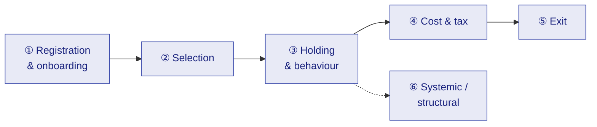

# M19 · Twenty-Five Problems Faced by Investors

!!! abstract "Learning objectives"
    By the end of this module you will be able to:

    - Recognise the **25 most common problems** an Indian mutual-fund investor hits, from registration to exit and beyond.
    - For each, name the **cause, the impact, and the mitigation** — tied back to the module that fixes it.
    - See where problems are **behavioural**, where they are **structural/incentive-driven**, and where they are **systemic**.

This is a synthesis module: it re-reads M1–M18 through the lens of *what actually goes wrong*. Each problem links to the module that solves it and, where relevant, the SEBI provision that bears on it. **(No quizzes — this is a reference map.)**

---

## 1. Intuition first — most "investment losses" are avoidable process errors

Very few investors are ruined by picking a slightly worse fund. They are hurt by **process and behaviour**: a blocked KYC that delays years of compounding, a regular plan quietly bleeding 1% a year, an SIP stopped at the bottom, a debt-tax surprise, an unclaimed folio. The good news: nearly every problem below is **preventable** with the knowledge already in this program. This module is the checklist.

---

## 2. Cluster ① — Registration & onboarding (Problems 1–5)

| # | Problem | Cause | Impact | Mitigation |
|---|---|---|---|---|
| 1 | **KYC On-Hold / PAN–Aadhaar unlinked** | Mismatch or unlinked PAN under the 2026 KYC regime | First investment **blocked**; years of delay | Get KYC to **Validated**, link PAN–Aadhaar first ([**M5**](m05-investor-journey.md)) |
| 2 | **No nominee** | Skipped at folio creation | Folio becomes **unclaimed**; legal tangle for heirs | Name up to **10 nominees** (or opt out consciously) ([**M5**](m05-investor-journey.md)) |
| 3 | **Cut-off / realisation confusion** | Thinking order-time = NAV day | Wrong (often worse) **applicable NAV** | Ensure funds **realise** before 3 pm cut-off ([**M5**](m05-investor-journey.md)) |
| 4 | **Wrong plan (Regular not Direct)** at signup | Default via distributor/app | **~1%/yr lifetime** cost drag (₹14L+ over 20 yrs) | Choose **Direct**, or pay a fee-only RIA (**M2/M4**) |
| 5 | **Mandate / e-mandate failure** | NACH/UPI ceiling too low or bank issue | **Missed SIP** instalments, broken discipline | Set ceiling **above** SIP; monitor early debits ([**M5**](m05-investor-journey.md)) |

---

## 3. Cluster ② — Selection (Problems 6–11)

| # | Problem | Cause | Impact | Mitigation |
|---|---|---|---|---|
| 6 | **Mis-selling** | Commission-driven distributor incentive | Unsuitable/expensive funds | Know **who pays your adviser**; prefer RIA ([**M2**](m02-ecosystem.md)) |
| 7 | **NFO "₹10 is cheap" trap** | Confusing NAV level with value | Buying on a misconception | NAV level is **irrelevant** to return ([**M1**](m01-what-is-a-fund.md)) |
| 8 | **Performance / return chasing** | Buying last year's topper | Buy-high, mean-reversion, churn cost | Use **rolling returns vs TRI**, not point-to-point (**M7/M9**) |
| 9 | **Category confusion** (multi vs flexi; "debt = safe") | Reading names not rules | Mismatched risk | Read **category holding rules** & PRC (**M3/M11**) |
| 10 | **Portfolio overlap / false diversification** | Many similar funds | One bet split 5 ways, extra cost/tax | Check **overlap/HHI**; 4–6 funds (**M11/M15**) |
| 11 | **Sectoral/thematic as a core** | Chasing a hot theme | Concentrated, mistimed bets | Keep thematic **small/satellite** (**M3/M15**) |

---

## 4. Cluster ③ — Holding & behaviour (Problems 12–16)

| # | Problem | Cause | Impact | Mitigation |
|---|---|---|---|---|
| 12 | **Panic-selling / stopping SIP in a crash** | Fear; loss aversion | Forfeits cheapest units; **permanent** loss | Keep SIPs running; crashes buy most units ([**M6**](m06-lifecycle-decisions.md)) |
| 13 | **Neglect / no monitoring** | "Set and forget" too literally | Drift, manager change, risk creep missed | Review **quarterly** on a rule ([**M13**](m13-monitoring-rebalancing.md)) |
| 14 | **IDCW confusion** | Treating payout as bonus income | Tax-inefficient; capital returned to self | Default **Growth**; use **SWP** for income (**M1/M8**) |
| 15 | **Over-monitoring / over-trading** | Watching daily NAV | Cost, tax, anxiety | Monitor periodically, **act on a rule** ([**M13**](m13-monitoring-rebalancing.md)) |
| 16 | **No asset allocation / 100% equity** | No plan; recency bias | Wrong risk for horizon → panic | **Allocate first** (capacity∧tolerance∧need) ([**M15**](m15-portfolio-construction.md)) |

---

## 5. Cluster ④ — Cost & tax (Problems 17–20)

| # | Problem | Cause | Impact | Mitigation |
|---|---|---|---|---|
| 17 | **Regular-plan cost drag** | Commission for advice not received | Compounding 0.5–1%/yr loss | Switch to **Direct** (break-even <1 yr) (**M4/M14**) |
| 18 | **Misreading TER post-unbundling** | "TER rose → fund got dearer" | Wrong fund decisions | Compare **like-for-like** BER + costs ([**M4**](m04-cost-and-plans.md)) |
| 19 | **Debt-tax shock** | Post-Apr-2023 debt taxed at **slab** | Unexpected tax bill | Plan for **Sec 50AA**; use arbitrage/hybrids (**M8/M16**) |
| 20 | **Unharvested exemption / FIFO ignored** | Not using ₹1.25L; redeeming <12m | Overpaid tax (20% STCG) | **Harvest** yearly; mind FIFO/holding ([**M14**](m14-tax-aware-exit.md)) |

---

## 6. Cluster ⑤ — Exit (Problems 21–22)

| # | Problem | Cause | Impact | Mitigation |
|---|---|---|---|---|
| 21 | **Exit-load / STCG surprise** | Redeeming inside load/12-month window | Avoidable load + 20% STCG | Check **load window & FIFO** before exit (**M4/M14**) |
| 22 | **Switching for a tiny edge** | Chasing a marginally better fund | Tax/load **eats** the benefit for years | Use the **break-even framework**; switch for cause ([**M14**](m14-tax-aware-exit.md)) |

---

## 7. Cluster ⑥ — Systemic / structural (Problems 23–25)

| # | Problem | Cause | Impact | Mitigation |
|---|---|---|---|---|
| 23 | **Advice gap / mis-aligned incentives** | MFD paid by AMC, not investor | Conflicted guidance | Choose **fee-only RIA**; understand incentives (**M2/M17**) |
| 24 | **Debt liquidity/credit events** | AT1 write-down, default, gating | Sudden NAV hit, frozen money | Read **duration/credit/PRC/AT1**, side-pockets ([**M11**](m11-portfolio-internals-debt.md)) |
| 25 | **Grievance & tracing friction / unclaimed wealth** | Lost folios, slow redress | Money stranded | **MITRA** to trace; **AMC→SCORES→ODR** ladder (**M2/M5**) |

---

## 8. The pattern — three root causes

!!! note "Most of the 25 trace to three roots"
    1. **Behaviour** (12, 15, 8, 16) — fear, greed, recency, inertia. *The biggest destroyer of returns.*
    2. **Mis-aligned incentives** (4, 6, 17, 23) — commission-driven selling and the regular-plan default.
    3. **Knowledge gaps** (1, 3, 7, 9, 14, 18, 19, 20, 21, 24) — not understanding the mechanics this program teaches.

    The 2026 Regulations attack roots 2 and 3 directly — **direct plans, true-to-label, TER unbundling, KMP accountability, MITRA, strengthened grievance** ([**M18**](m18-sebi-regulations-2026.md)). Root 1 is on the investor — which is why **process and automation** (**M5/M6/M13**) matter most.

---

## 9. Common mistakes & Do's and Don'ts

!!! success "Do"
    - **Do** fix onboarding once, cleanly (KYC Validated, nominee, Direct, mandate).
    - **Do** automate (SIP) and **review on a rule**, not on emotion.
    - **Do** mind **cost, tax buckets, FIFO and the exemption** at every move.

!!! failure "Don't"
    - **Don't** stop SIPs in a crash, chase last year's winner, or switch for a sliver of return.
    - **Don't** ignore your KYC status, nominee, plan type, or a debt fund's credit/duration.

---

## 10. Applicable SEBI (Mutual Funds) Regulations, 2026

The 2026 framework is, in large part, a **response** to these very problems ([**M18**](m18-sebi-regulations-2026.md)):

- **Direct-plan mandate, TER unbundling, true-to-label** — attack mis-selling and cost opacity (Problems 4, 6, 8, 9, 17, 18). *[verify]*
- **KYC/Aadhaar regime, nomination (10 nominees), MITRA, SCORES/ODR** — attack onboarding and unclaimed-folio problems (1, 2, 25). *[verify]*
- **Scheme-overlap cap, categorisation** — attack false diversification and category confusion (9, 10, 11). *[verify]*
- **Valuation, liquidity/stress, side-pocketing, AT1 norms** — attack debt blow-ups (24). *[verify]*
- **KMP accountability** — attacks the incentive root (6, 23). *[verify]*

---

## 11. Key takeaways

!!! quote "Key takeaways"
    - Most investor losses are **avoidable process and behaviour errors**, not fund-selection errors.
    - The 25 cluster into **onboarding, selection, holding/behaviour, cost/tax, exit, and systemic** problems.
    - Three roots: **behaviour, mis-aligned incentives, knowledge gaps** — the first is yours to manage; 2026 law tackles the other two.
    - The fixes are already in this program: **clean onboarding (M5), discipline (M6/M13), cost/tax awareness (M4/M8/M14), and reading internals (M11)**.

---

## 12. A word from the field

!!! quote "On the behavioural root"
    *"Be fearful when others are greedy, and greedy when others are fearful."*

    — **Warren Buffett**. The single most expensive problem on this list — panic-selling and stopping SIPs in a crash — is solved by inverting the crowd's emotion. Most of the other 24 are solved simply by **knowing the mechanics** this program has taught.
