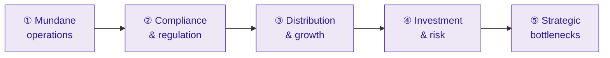

# M20 · Twenty-Five Problems Faced by Fund Houses, AMCs & Distributors

!!! abstract "Learning objectives"
    By the end of this module you will be able to:

    - Map the **25 operational, regulatory, commercial and strategic problems** of running a fund house or distribution business in 2026.
    - For each, name the **cause, impact and response**, from **mundane operations** up to **strategic bottlenecks**.
    - See how the **2026 Regulations** and **fee compression** reshape the supply side — the mirror of the investor problems in [**M19**](m19-problems-investors.md).

This is the supply-side synthesis, built on the **ecosystem (M2)**, **cost (M4)**, **economics (M17)** and **law (M18)**. **(No quizzes — a reference map.)**

---

## 1. Intuition first — an AMC is a thin-margin, high-trust, heavily-regulated factory

A fund house looks glamorous (markets, star managers) but runs like a **regulated processing factory**: millions of folios, daily NAVs that must be exactly right, relentless disclosure, and a wafer-thin fee on each rupee ([**M17**](m17-industry-economics.md)). Its problems are mostly *operational and regulatory*, not glamorous — and in 2026 they are intensifying as **fee compression** squeezes margins while the **new Regulations** raise the compliance bar. The supply-side problems below are the flip side of the investor problems in [**M19**](m19-problems-investors.md).

---

## 2. Cluster ① — Mundane operations (Problems 1–6)

| # | Problem | Cause | Impact | Response |
|---|---|---|---|---|
| 1 | **KYC / onboarding ops load** | High volume, 2026 Aadhaar-PAN validation | Drop-offs, rework, cost | Straight-through e-KYC, CKYC reuse ([**M5**](m05-investor-journey.md)) |
| 2 | **Daily NAV & cut-off accuracy** | Must strike one exact NAV/day | A NAV error → **investor compensation**, censure | Automation, controls, fund-accounting rigour ([**M1**](m01-what-is-a-fund.md)) |
| 3 | **RTA dependency / duopoly** | Outsourced to CAMS & KFintech | Concentration & continuity risk | SLAs, BCP, oversight of QRTAs ([**M2**](m02-ecosystem.md)) |
| 4 | **Folio data quality & unclaimed folios** | Stale KYC, missing nominees | Stranded money, **MITRA** obligations | Data hygiene, MITRA, re-KYC drives ([**M5**](m05-investor-journey.md)) |
| 5 | **Multi-party reconciliation** | AMC ↔ custodian ↔ RTA ↔ bank | Breaks, settlement risk | Automated recon, exception handling ([**M2**](m02-ecosystem.md)) |
| 6 | **Grievance volume & turnaround** | Large investor base; SCORES/ODR clocks | Regulatory scrutiny, reputation | Service desks, root-cause fixes ([**M2**](m02-ecosystem.md)) |

---

## 3. Cluster ② — Compliance & regulatory burden (Problems 7–12)

| # | Problem | Cause | Impact | Response |
|---|---|---|---|---|
| 7 | **BER/TER unbundling re-engineering** | 2026 cost re-architecture | Accounting/disclosure systems rebuilt | Re-plumb fee engines, restate TER (**M4/M18**) |
| 8 | **Scheme-overlap monitoring** | 50% cap, **monthly**, daily values | Heavy computation & disclosure | Overlap analytics, portfolio tooling (**M3/M18**) |
| 9 | **Name changes / re-categorisation** | True-to-label by ~Aug 2026 | Rebranding, legal, investor comms | Project-manage transitions ([**M18**](m18-sebi-regulations-2026.md)) |
| 10 | **KMP personal accountability** | CEO/CIO/compliance personally liable | Higher personal risk, governance load | Strengthen controls, documentation (**M2/M18**) |
| 11 | **Solution-oriented closure / Life Cycle launch** | 2026 product changes | Ops to wind-down & launch | Re-paper products, systems (**M3/M18**) |
| 12 | **Disclosure load** | Factsheets, stress tests, riskometer, portfolio freq. | Continuous reporting cost | Reg-tech, disclosure automation (**M7/M11**) |

---

## 4. Cluster ③ — Distribution & growth (Problems 13–17)

| # | Problem | Cause | Impact | Response |
|---|---|---|---|---|
| 13 | **Fee compression** | Passive price war, scale economics | Eroding revenue yield | Scale up, cut costs, passive line-up (**M4/M17**) |
| 14 | **Direct-plan & fintech disintermediation** | Investors going direct | Distributor margin loss, channel shift | Own D2C platforms, RIA tie-ups (**M2/M17**) |
| 15 | **Distributor commission economics / B30 / clawback** | Commission rules, early-redemption clawback | Channel friction, mis-incentive risk | Aligned trail models, compliance ([**M17**](m17-industry-economics.md)) |
| 16 | **Mis-selling & conduct risk** | Commission-driven pressure | Reputational + regulatory penalty | Suitability, training, surveillance ([**M19**](m19-problems-investors.md)) |
| 17 | **Customer-acquisition cost / NFO dependence** | Competition for flows | Margin drag, churn | Brand, retention, SIP stickiness ([**M17**](m17-industry-economics.md)) |

---

## 5. Cluster ④ — Investment & risk management (Problems 18–21)

| # | Problem | Cause | Impact | Response |
|---|---|---|---|---|
| 18 | **Redemption / liquidity management** | Open-ended run risk | Forced selling, NAV impact | Liquid buffers, **stress testing** (**M11/M18**) |
| 19 | **Credit events / AT1 / side-pocketing** | Default or write-down in debt book | NAV hit, reputational damage | Credit research, **segregated portfolios** ([**M11**](m11-portfolio-internals-debt.md)) |
| 20 | **Capacity constraints (small/mid-cap)** | Size blunts agility | Impact cost, mandate strain | Cap inflows, stress-test disclosure (**M3/M11**) |
| 21 | **Benchmark-hugging / closet indexing dilemma** | Career risk of deviating | Low active share, fee-justification gap | Honest active/passive line-up ([**M10**](m10-alpha-beta-attribution.md)) |

---

## 6. Cluster ⑤ — Strategic bottlenecks (Problems 22–25)

| # | Problem | Cause | Impact | Response |
|---|---|---|---|---|
| 22 | **Scheme proliferation limits / forced mergers** | One-scheme-per-category; overlap rule | Rationalisation, merger projects | Portfolio of distinct, true-to-label schemes (**M3/M18**) |
| 23 | **Talent / key-person (fund-manager) risk** | Star-manager dependence | Outflows on a manager exit | Team-based process, succession ([**M7**](m07-factsheet-sid.md)) |
| 24 | **Tech, cyber & data security** | Digital scale, sensitive data | Breach, outage, regulatory action | Cyber resilience, data governance |
| 25 | **AMC margin pressure / consolidation** | Operating leverage favours scale ([**M17**](m17-industry-economics.md)) | Sub-scale AMCs unviable → M&A | Scale, niche focus, or exit |

---

## 7. The pattern — the 2026 squeeze

!!! note "Two forces define the supply side in 2026"
    1. **Regulatory intensity ↑** — unbundling, overlap monitoring, true-to-label, KMP accountability, disclosure (Problems 7–12, 22) **raise the cost and personal stakes** of running a fund house.
    2. **Margin ↓** — fee compression, direct/fintech disintermediation and the passive price war (13–14, 25) **shrink the revenue per rupee**.

    Squeezed between rising compliance cost and falling fees, **operating leverage and scale (M17)** become existential: large AMCs absorb the burden, sub-scale ones face **consolidation**. The investor is the net beneficiary — cheaper, more transparent, better-governed funds — which is precisely the 2026 design intent ([**M18**](m18-sebi-regulations-2026.md)).

---

## 8. Common mistakes & Do's and Don'ts (operator's lens)

!!! success "Do"
    - **Do** invest in **automation and reg-tech** — NAV accuracy, recon, overlap and disclosure are non-negotiable.
    - **Do** build **team-based, true-to-label** products and align distributor incentives.
    - **Do** treat **scale and cost discipline** as survival under fee compression.

!!! failure "Don't"
    - **Don't** depend on a single **star manager** or a flood of **me-too NFOs**.
    - **Don't** let conduct/mis-selling risk fester — KMP accountability makes it personal.

---

## 9. Applicable SEBI (Mutual Funds) Regulations, 2026

These problems are largely *created or intensified* by 2026 compliance ([**M18**](m18-sebi-regulations-2026.md)), by design:

- **BER/TER unbundling, brokerage caps, performance fees** — re-engineer fee systems & margins (7, 13). *[verify]*
- **True-to-label, one-per-category, 50% overlap, name changes** — force rationalisation/mergers (8, 9, 22). *[verify]*
- **KMP accountability, governance** — raise personal and compliance stakes (10, 16). *[verify]*
- **Valuation, liquidity/stress, side-pocketing, AT1** — shape risk-management duties (18–20). *[verify]*
- **MITRA, KYC, grievance (SCORES/ODR)** — add servicing obligations (1, 4, 6). *[verify]*

---

## 10. Key takeaways

!!! quote "Key takeaways"
    - An AMC is a **thin-margin, high-trust, heavily-regulated factory** — its problems are mostly **operational and regulatory**, not glamorous.
    - 2026 brings a **squeeze**: compliance intensity **up** (unbundling, overlap, true-to-label, KMP) and **margins down** (fee compression, direct/fintech).
    - Problems run from **mundane ops** (NAV accuracy, recon, RTA dependence) to **strategic bottlenecks** (mergers, key-person risk, consolidation).
    - **Scale, automation and cost discipline** are now survival traits; the **investor is the net beneficiary**.
    - These supply-side problems are the **mirror image of M19's** investor problems.

---

## 11. A word from the field

!!! quote "On margin pressure"
    *"Your margin is my opportunity."*

    — **Jeff Bezos**. The passive price war and fintech disintermediation are exactly this dynamic aimed at the AMC's fee: every basis point of "fat" expense ratio is a competitor's (or an index fund's) opening. The 2026 squeeze rewards the **lean, transparent and scaled** — and pressures everyone else.
